# CURRENT FRONTEND DOCUMENTATION

> **Notice:** This document is an exact, code-level analysis of the **current, existing frontend** of the HackTrack project. It does not propose changes, hypothetical architectures, refactors, or future improvements. Everything documented herein is extracted directly from the existing source code.

---

# 1. Current Frontend Stack

Extracted directly from `hacktrack/package.json`, `hacktrack/app/globals.css`, and import declarations across the frontend codebase:

| Category | Technology | Version / Specifics | Source / Evidence |
|---|---|---|---|
| **Framework** | Next.js (App Router) | `16.3.6` | `package.json` dependencies (`"next": "16.3.6"`) |
| **Language** | TypeScript | `^5` | `package.json` devDependencies, `tsconfig.json` |
| **UI Library** | React & React DOM | `19.2.8` | `package.json` dependencies (`"react": "19.2.8"`) |
| **Styling Engine** | Tailwind CSS | `^4` (with `@tailwindcss/postcss`) | `globals.css` (`@import "tailwindcss";`), `package.json` |
| **Design System** | Custom Neubrutalism | Custom CSS tokens & utilities | `globals.css` (`.brutal-btn`, `.brutal-card`, `.brutal-border`, `.brutal-shadow`) |
| **Component Library** | Custom Neubrutalist UI Primitives | In-house primitives (`button`, `card`, `badge`, `input`, `textarea`) | `components/ui/` directory |
| **Icon Library** | Lucide React | `^1.48.0` | `package.json` (`"lucide-react": "^1.48.0"`), imported in all components |
| **Toast Notifications** | Sonner | `^2.0.8` | `package.json` (`"sonner": "^2.0.8"`), `components/ToasterClient.tsx` |
| **CSS Utilities** | clsx & tailwind-merge | `clsx: ^2.1.1`, `tailwind-merge: ^3.7.0` | `lib/utils.ts` (`cn` helper) |
| **Date Formatting** | date-fns & Native Intl | `date-fns: ^4.4.0` + custom `formatDate` | `lib/utils.ts`, `package.json` |
| **Validation** | Zod | `^4.6.5` | `actions/*.ts`, `package.json` |
| **Client State Management** | React useState & useActionState | Native React hooks (`useState`, `useEffect`, `useActionState`) | `app/login/page.tsx`, `components/*.tsx` |
| **Server State / Data Fetching** | Next.js Server Components & Server Actions | `dynamic = "force-dynamic"`, async Server Components + `"use server"` actions | `app/**/page.tsx`, `actions/*.ts` |
| **Routing** | Next.js App Router | File-system routing with layouts and dynamic params `[id]` | `app/` folder conventions |
| **Frontend Authentication** | Signed JWT HTTP-only cookie + Middleware | Session verified via Next.js Proxy/Middleware, read via `getSession()` | `middleware.ts`, `lib/auth.ts`, `app/layout.tsx` |
| **Fonts** | System UI Sans Stack & Monospace | `-apple-system, BlinkMacSystemFont, "Segoe UI", Roboto...` + `monospace` / `font-mono` | `globals.css`, Tailwind font utilities |

---

# 2. Current Frontend Folder Structure

```text
hacktrack/
├── app/
│   ├── globals.css                         # Core Neubrutalism design tokens, reset, and utilities
│   ├── layout.tsx                          # Root application layout (Navbar, ToasterClient, HTML shell)
│   ├── page.tsx                            # Root redirector (Auth check -> /dashboard or /login)
│   ├── login/
│   │   └── page.tsx                        # Admin login card interface
│   ├── dashboard/
│   │   └── page.tsx                        # Command Center overview, KPI metrics, upcoming hackathons
│   ├── hackathons/
│   │   ├── page.tsx                        # Hackathons directory grid
│   │   ├── new/
│   │   │   └── page.tsx                    # Hackathon creation form + automated broadcast configuration
│   │   └── [id]/
│   │       ├── page.tsx                    # Hackathon detail view (Overview, Participants, Broadcasts)
│   │       └── edit/
│   │           └── page.tsx                # Hackathon edit wrapper page
│   └── settings/
│       └── page.tsx                        # Gmail OAuth integration, worker status & Google Cloud guide
│
├── components/
│   ├── Navbar.tsx                          # Sticky top Neubrutalist navigation header
│   ├── ToasterClient.tsx                   # Client wrapper for Sonner toast alerts
│   ├── ParticipantManager.tsx              # Participant listing, search, add drawer, and deletion
│   ├── MessageScheduler.tsx                # Broadcast composer, datetime scheduler, and delivery tracking log
│   ├── GoogleConnectCard.tsx               # Google OAuth connection card with instant Demo Mode trigger
│   ├── EditHackathonForm.tsx               # Pre-filled edit form with delete confirmation
│   └── ui/                                 # Shared Neubrutalist primitives
│       ├── button.tsx                      # Tactile button (primary, secondary, blue, mint, outline, dark)
│       ├── card.tsx                        # Card, CardHeader, CardTitle, CardDescription, CardContent, CardFooter
│       ├── badge.tsx                       # Badge (yellow, coral, blue, mint, neutral, outline) & StatusBadge
│       ├── input.tsx                       # Text/number/date input with bold label and error display
│       └── textarea.tsx                    # Resizable textarea with bold label and error display
│
├── lib/
│   ├── utils.ts                            # Class merge helper (cn) and date formatters (formatDate, formatDateTime)
│   └── auth.ts                             # Session verification and token cookies
│
├── types/
│   └── index.ts                            # TypeScript interfaces for Hackathon, Participant, Message, Recipient
│
└── public/                                 # Static SVG assets
    ├── file.svg
    ├── globe.svg
    ├── next.svg
    ├── vercel.svg
    └── window.svg
```

---

# 3. Every Current Page

| Route | File Location | Render Type | Purpose | Layout Used |
|---|---|---|---|---|
| `/` | `app/page.tsx` | Server Component | Redirects authenticated admin to `/dashboard`, else `/login` | `RootLayout` (`app/layout.tsx`) |
| `/login` | `app/login/page.tsx` | Client Component (`"use client"`) | Admin credentials entry form with validation errors | `RootLayout` (Navbar self-hides on `/login`) |
| `/dashboard` | `app/dashboard/page.tsx` | Server Component (`force-dynamic`) | Primary Command Center: KPI metrics, Gmail status banner, upcoming hackathons feed | `RootLayout` |
| `/hackathons` | `app/hackathons/page.tsx` | Server Component (`force-dynamic`) | Directory of all organized hackathons with counts, fees, and dates | `RootLayout` |
| `/hackathons/new` | `app/hackathons/new/page.tsx` | Client Component (`"use client"`) | Form to create a new hackathon, schedule an automated participant broadcast, and pre-register participants | `RootLayout` |
| `/hackathons/[id]` | `app/hackathons/[id]/page.tsx` | Server Component (`force-dynamic`) | Comprehensive event dashboard: overview, participant management table, and scheduled broadcasts with delivery logs | `RootLayout` |
| `/hackathons/[id]/edit` | `app/hackathons/[id]/edit/page.tsx` | Server Component (`force-dynamic`) | Wrapper page loading existing hackathon data into the edit form | `RootLayout` |
| `/settings` | `app/settings/page.tsx` | Server Component (`force-dynamic`) | Gmail OAuth connection status, Demo mode toggle, background daemon status, and setup instructions | `RootLayout` |
| `/_not-found` | Built-in Next.js | Server Component | Default fallback route for missing resources | `RootLayout` |

---

# 4. Detailed Analysis of EACH Page

---

### PAGE: Root Redirector
* **Route:** `/`
* **Source:** `app/page.tsx`
* **Render Mode:** Server Component

```text
HomePage (app/page.tsx)
└── getSession()
    ├── If session -> redirect("/dashboard")
    └── If no session -> redirect("/login")
```

---

### PAGE: Admin Login
* **Route:** `/login`
* **Source:** `app/login/page.tsx`
* **Render Mode:** Client Component (`"use client"`)

```text
LoginPage
│
└── Container (min-h-[85dvh] flex flex-col items-center justify-center)
    └── Wrapper (max-w-md w-full)
        │
        ├── BrandHeader
        │   ├── LogoBadge (w-16 h-16 bg-[#FFEB3B] border-3 shadow-brutal "HT")
        │   ├── Title (H1: "HACKTRACK")
        │   └── Subtitle ("Sign in to your Administrator Command Center")
        │
        └── LoginCard (brutal-card bg-white p-6 md:p-8)
            ├── Badge ("Admin Authentication", Lock icon)
            ├── ErrorCallout (conditional, bg-[#FF5252]/15 border-2 border-[#FF5252])
            ├── Form (action={formAction})
            │   ├── Input (label="Admin Email", type="email", name="email")
            │   ├── Input (label="Password", type="password", name="password")
            │   └── Button (type="submit", variant="primary", ArrowRight icon)
            └── FooterHint ("Default Seed: admin@hacktrack.com / adminpassword123")
```

---

### PAGE: Dashboard
* **Route:** `/dashboard`
* **Source:** `app/dashboard/page.tsx`
* **Render Mode:** Server Component (`export const dynamic = "force-dynamic"`)

```text
DashboardPage
│
├── TopBannerCard (brutal-card bg-[#FFEB3B] p-6)
│   ├── HeaderInfo
│   │   ├── CategoryPill ("OVERVIEW")
│   │   ├── Title (H1: "Administrator Command Center")
│   │   └── Description
│   └── ActionButtonGroup
│       ├── Link -> Button (variant="dark", "+ Create Hackathon", Plus icon)
│       └── Link -> Button (variant="outline", "Gmail Settings", Mail icon)
│
├── GmailStatusNotice (Conditional Card)
│   ├── [If Disconnected]: Coral Banner (AlertTriangle icon, "Connect Gmail Now" Button)
│   └── [If Connected]: Mint Banner (CheckCircle2 icon, "● Active" Badge, sender email)
│
├── KPIMetricsGrid (grid-cols-1 sm:grid-cols-2 lg:grid-cols-4)
│   ├── Card: Total Hackathons (Yellow icon container, Calendar icon, count, subtitle)
│   ├── Card: Upcoming (Blue icon container, Clock icon, count, subtitle)
│   ├── Card: Total Participants (Mint icon container, Users icon, count, subtitle)
│   └── Card: Scheduled Messages (Coral icon container, Send icon, count, broadcasts sent)
│
└── UpcomingHackathonsSection
    ├── SectionHeader
    │   ├── Title (H2: "Upcoming Hackathons")
    │   ├── Subtitle
    │   └── ViewAllLink ("View All (X)", ArrowUpRight icon)
    └── ContentContainer
        ├── [If Empty]: EmptyStateCard (Calendar icon, description, "Create First Hackathon" Button)
        └── [If Has Items]: Grid (grid-cols-1 md:grid-cols-2 lg:grid-cols-3)
            └── HackathonCards[]
                ├── CardHeader (Fee badge, Event date with Clock icon)
                ├── Title (H3: hackathon.name)
                ├── Description (line-clamp-2)
                ├── MetadataList (Location with MapPin icon, Participants count with Users icon)
                └── CardFooter
                    └── Link -> Button (variant="outline", "View Details", ArrowUpRight icon)
```

---

### PAGE: Hackathons Directory
* **Route:** `/hackathons`
* **Source:** `app/hackathons/page.tsx`
* **Render Mode:** Server Component (`export const dynamic = "force-dynamic"`)

```text
HackathonsPage
│
├── PageHeader (flex justify-between items-center pb-6 border-b-3)
│   ├── Title & Subtitle (H1: "Hackathons Directory", active count)
│   └── Link -> Button (variant="primary", "+ Create Hackathon", Plus icon)
│
└── ContentArea
    ├── [If Empty]: EmptyStateCard (Calendar icon, "+ Create First Hackathon" Button)
    └── [If Has Items]: Grid (grid-cols-1 md:grid-cols-2 lg:grid-cols-3)
        └── HackathonCards[]
            ├── StatusAndFeeRow
            │   ├── Badge (Upcoming / Past Event)
            │   └── Badge (variant="blue", fee string)
            ├── Title (H2: hackathon.name)
            ├── Description (line-clamp-3)
            ├── EventDatesAndLocation
            │   ├── Event Date (Calendar icon, formatDate)
            │   ├── Reg. Deadline (Clock icon, formatDate)
            │   └── Location (MapPin icon)
            └── BottomActionBar
                ├── PillCounters (Participants count in green, Broadcasts count in blue)
                └── Link -> Button (variant="outline", "Manage", ArrowRight icon)
```

---

### PAGE: Create New Hackathon
* **Route:** `/hackathons/new`
* **Source:** `app/hackathons/new/page.tsx`
* **Render Mode:** Client Component (`"use client"`)

```text
NewHackathonPage
│
├── BackLink ("Back to Directory", ArrowLeft icon)
│
└── FormCard (brutal-card bg-white p-6 md:p-8)
    ├── CardHeader (PlusCircle icon in yellow square, H1: "Create New Hackathon")
    ├── ErrorBanner (conditional, if error state exists)
    └── Form (onSubmit={handleSubmit})
        │
        ├── Section 1: Hackathon Information
        │   ├── SectionHeading (Calendar icon, "1. Hackathon Information")
        │   ├── Input (name="name", label="Hackathon Name")
        │   ├── Textarea (name="description", label="Description")
        │   ├── Textarea (name="roundDetails", label="Round Details & Milestones (Optional)")
        │   ├── Grid (2 columns: "hackathonDate", "registrationDeadline" datetime inputs)
        │   ├── Grid (2 columns: "fee", "location" text inputs)
        │   └── Input (name="registrationLink", label="External Registration URL (Optional)")
        │
        ├── Section 2: Automated Participant Email Broadcast
        │   └── HighlightedContainer (bg-[#FFEB3B]/15 border-3 border-[#121212] p-5)
        │       ├── ContainerHeader (Send icon, H3, Checkbox: "Schedule Broadcast")
        │       ├── DescriptiveText
        │       └── [If Checked]:
        │           ├── Input (name="broadcastSubject", label="Broadcast Message Title / Subject")
        │           ├── Textarea (name="broadcastMessage", label="Broadcast Message Description / Body")
        │           ├── DynamicTokensHelper (Badges: "{name}", "{hackathonName}")
        │           └── Input (name="broadcastScheduledAt", type="datetime-local", label="Broadcast Send Date & Time")
        │
        ├── Section 3: Initial Participants (Optional)
        │   ├── SectionHeading (Users icon, "3. Initial Participants (Optional)")
        │   └── Textarea (name="initialParticipants", label="Pre-register Participants (One per line)")
        │
        └── FormActionBar (border-t-3 border-[#121212] flex justify-end gap-3)
            ├── Link -> Button (variant="outline", "Cancel")
            └── Button (type="submit", variant="primary", "Save & Launch Hackathon", Sparkles icon)
```

---

### PAGE: Hackathon Detail View
* **Route:** `/hackathons/[id]`
* **Source:** `app/hackathons/[id]/page.tsx`
* **Render Mode:** Server Component (`export const dynamic = "force-dynamic"`)

```text
HackathonDetailPage
│
├── BackLink ("Back to Hackathons", ArrowLeft icon)
│
├── OverviewCard (brutal-card bg-white p-6 md:p-8)
│   ├── HeaderTopRow
│   │   ├── StatusAndFeeBadges (Upcoming badge, Fee badge)
│   │   ├── Title (H1: hackathon.name)
│   │   └── Description
│   ├── HeaderActions
│   │   ├── ExternalLinkButton (conditional, if registrationLink exists)
│   │   └── Link -> Button (variant="primary", "Edit Hackathon", Edit3 icon)
│   ├── MetadataGrid (3 columns: Event Date, Registration Deadline, Location)
│   └── RoundDetailsContainer (conditional, if roundDetails exists, Award icon)
│
├── ParticipantManager (Client Component)
│   ├── Header (Users icon, "Participants", "X Registered" badge, "+ Add Participant" button)
│   ├── [If isAdding]: AddParticipantForm (Name input, Gmail input, Cancel & Submit buttons)
│   ├── [If participants > 5]: SearchInput
│   └── TableContainer
│       ├── [If Empty]: EmptyStateBox
│       └── [If Has Items]: Table (Columns: Builder, Gmail Address, Action [Trash2 button])
│
└── MessageScheduler (Client Component)
    ├── Header (Send icon, "Scheduled Email Broadcasts", "X Messages" badge, Check Due button, "+ Schedule Message" button)
    ├── [If isScheduling]: ScheduleBroadcastForm
    │   ├── Subject input
    │   ├── Message textarea (dynamic token hints)
    │   ├── Datetime picker input
    │   ├── Recipient mode radio buttons ("All Participants" vs "Select Specific")
    │   ├── [If Selected Specific]: Checkbox list of participants
    │   └── Submit & Cancel buttons
    └── BroadcastMessagesList
        ├── [If Empty]: EmptyStateBox
        └── [If Has Items]: MessageCards[]
            ├── CardHeader (StatusBadge, Scheduled time, Sent time, Subject, Snippet)
            ├── ActionButtons (Cancel button [if SCHEDULED], Delivery Log toggle button)
            └── [If Expanded]: DeliveryLogDrawer
                ├── SummaryStats (SENT count in green, FAILED count in red, PENDING count in blue)
                └── RecipientRows[] (Participant name, email, StatusBadge/Icon, Sent timestamp, error message tooltip)
```

---

### PAGE: Edit Hackathon
* **Route:** `/hackathons/[id]/edit`
* **Source:** `app/hackathons/[id]/edit/page.tsx`
* **Render Mode:** Server Component wrapping `EditHackathonForm`

```text
EditHackathonPage
│
├── BackLink ("Back to {hackathon.name}", ArrowLeft icon)
│
└── EditHackathonForm (Client Component)
    ├── FormHeader (Edit icon in blue square, H1: "Edit Hackathon", "Delete Hackathon" Button in red)
    ├── ErrorBanner (conditional)
    └── Form (onSubmit={handleSubmit})
        ├── Input (name="name", defaultValue)
        ├── Textarea (name="description", defaultValue)
        ├── Textarea (name="roundDetails", defaultValue)
        ├── Grid (2 columns: datetime inputs for hackathonDate & registrationDeadline)
        ├── Grid (2 columns: fee & location inputs)
        ├── Input (name="registrationLink", defaultValue)
        └── FormActionBar
            ├── Link -> Button (variant="outline", "Cancel")
            └── Button (type="submit", variant="mint", "Save Changes", CheckCircle2 icon)
```

---

### PAGE: Settings & Integrations
* **Route:** `/settings`
* **Source:** `app/settings/page.tsx`
* **Render Mode:** Server Component (`export const dynamic = "force-dynamic"`)

```text
SettingsPage
│
├── PageHeader (H1: "System Settings & Integrations", Subtitle)
│
├── GoogleConnectCard (Client Component)
│   ├── CardHeader (Mail icon in yellow square, H2: "Gmail Dispatch Integration", Status Badge)
│   ├── [If Connected]:
│   │   ├── ActiveAccountInfo (CheckCircle2 icon, Account email, "Disconnect Account" Button)
│   │   └── SecurityNote (ShieldCheck icon)
│   └── [If Disconnected]:
│       ├── WarningCallout (AlertTriangle icon, warning text)
│       ├── ActionButtonsRow
│       │   ├── Button (variant="mint", "Connect Demo Account (Instant)", Zap icon)
│       │   └── Button (variant="primary", "Connect Official Gmail", ExternalLink icon)
│       └── ExplanatoryNotice
│
├── BackgroundWorkerStatusCard (brutal-card bg-white p-6 md:p-8)
│   ├── CardHeader (Terminal icon in blue square, H3: "Background Worker & Cron Architecture")
│   ├── MetricsList (Polling Interval: 15s, Worker Script: npm run worker, Cron Endpoint: /api/cron/process)
│   └── ArchitectureDescriptionText
│
└── GoogleCloudInstructionsCard (brutal-card bg-white p-6 md:p-8)
    ├── CardHeader (Key icon in yellow square, H3: "Google Cloud Console Configuration")
    ├── EnvironmentSnippet (Code block showing GOOGLE_CLIENT_ID, SECRET, REDIRECT_URI)
    └── StepByStepInstructions (Numbered list linking to Google Cloud Console)
```

---

# 5. Components Used on EACH Page

### Root Layout (`app/layout.tsx`)
* `Navbar` (`components/Navbar.tsx`) — Server-rendered parent passing session email to Client component.
* `ToasterClient` (`components/ToasterClient.tsx`) — Client component mounting Sonner toast notifications.

### Login Page (`app/login/page.tsx`)
* `Button` (`components/ui/button.tsx`) — Variant: `primary`, Size: `lg`.
* `Input` (`components/ui/input.tsx`) — Used for email and password.
* `Lock`, `ArrowRight` (`lucide-react`) — Icons.

### Dashboard Page (`app/dashboard/page.tsx`)
* `Card` (`components/ui/card.tsx`) — Used for top banner, KPI metrics, and hackathon cards.
* `Button` (`components/ui/button.tsx`) — Variants: `dark`, `outline`, `secondary`, `primary`.
* `Badge` (`components/ui/badge.tsx`) — Variants: `yellow`, `mint`.
* Icons from `lucide-react`: `Calendar`, `Users`, `Send`, `Mail`, `Plus`, `ArrowUpRight`, `MapPin`, `Clock`, `CheckCircle2`, `AlertTriangle`.

### Hackathons Directory (`app/hackathons/page.tsx`)
* `Button` (`components/ui/button.tsx`) — Variants: `primary`, `outline`.
* `Badge` (`components/ui/badge.tsx`) — Variants: `yellow`, `outline`, `blue`.
* Icons from `lucide-react`: `Plus`, `Calendar`, `Users`, `Send`, `MapPin`, `Clock`, `ArrowRight`, `ExternalLink`.

### Create New Hackathon (`app/hackathons/new/page.tsx`)
* `Button` (`components/ui/button.tsx`) — Variants: `outline`, `primary`.
* `Input` (`components/ui/input.tsx`) — Text, URL, and `datetime-local` types.
* `Textarea` (`components/ui/textarea.tsx`) — Description, round details, broadcast body, participants.
* `Badge` (`components/ui/badge.tsx`) — Variant: `outline` (for token indicators).
* Icons from `lucide-react`: `ArrowLeft`, `PlusCircle`, `Sparkles`, `Send`, `Users`, `Clock`, `Calendar`, `CheckCircle2`.

### Hackathon Detail Page (`app/hackathons/[id]/page.tsx`)
* `Button` (`components/ui/button.tsx`) — Variants: `outline`, `primary`.
* `Badge` (`components/ui/badge.tsx`) — Variants: `yellow`, `blue`, `outline`.
* `ParticipantManager` (`components/ParticipantManager.tsx`) — Interactive participant manager.
* `MessageScheduler` (`components/MessageScheduler.tsx`) — Interactive broadcast scheduler and tracking log.
* Icons from `lucide-react`: `Calendar`, `Clock`, `MapPin`, `ExternalLink`, `Edit3`, `ArrowLeft`, `Award`.

### Edit Hackathon Page (`app/hackathons/[id]/edit/page.tsx`)
* `EditHackathonForm` (`components/EditHackathonForm.tsx`) — Form component.
* `ArrowLeft` (`lucide-react`) — Back navigation icon.

### Settings Page (`app/settings/page.tsx`)
* `GoogleConnectCard` (`components/GoogleConnectCard.tsx`) — Interactive OAuth status manager.
* Icons from `lucide-react`: `Terminal`, `Key`, `ShieldCheck`.

---

# 6. Components Inside Each Component File

### `components/ui/button.tsx`
* **Component Export:** `Button` (via `React.forwardRef<HTMLButtonElement, ButtonProps>`)
* **Internal Elements:**
  * `<button className={cn("brutal-btn", variantStyles[variant], sizeStyles[size], className)} {...props}>`
* **Variants Implemented:**
  * `primary`: `bg-[#FFEB3B] text-[#121212] hover:bg-[#FDD835]`
  * `secondary`: `bg-[#FF5252] text-white hover:bg-[#FF1744]`
  * `blue`: `bg-[#2196F3] text-white hover:bg-[#1E88E5]`
  * `mint`: `bg-[#00E676] text-[#121212] hover:bg-[#00C853]`
  * `outline`: `bg-white text-[#121212] hover:bg-[#F4F4F5]`
  * `dark`: `bg-[#121212] text-white hover:bg-[#27272A]`
  * `ghost`: `border-none shadow-none hover:bg-black/5 hover:translate-none`
* **Sizes Implemented:**
  * `sm`: `px-3 py-1.5 text-xs rounded-md`
  * `md`: `px-4 py-2 text-sm rounded-lg`
  * `lg`: `px-6 py-3 text-base rounded-lg`

### `components/ui/card.tsx`
* **Component Exports:**
  * `Card`: `<div className={cn("brutal-card rounded-xl p-5 md:p-6", className)}>`
  * `CardHeader`: `<div className={cn("flex flex-col space-y-1.5 pb-4 border-b-2 border-[#121212] mb-4", className)}>`
  * `CardTitle`: `<h3 className={cn("font-black text-xl tracking-tight text-[#121212]", className)}>`
  * `CardDescription`: `<p className={cn("text-sm font-medium text-[#71717A]", className)}>`
  * `CardContent`: `<div className={cn("", className)}>`
  * `CardFooter`: `<div className={cn("flex items-center pt-4 border-t-2 border-[#121212] mt-4", className)}>`

### `components/ui/badge.tsx`
* **Component Exports:**
  * `Badge`: `<span className={cn("brutal-badge rounded-md font-mono text-[11px]", variantStyles[variant], className)}>`
    * Variants: `yellow`, `coral`, `blue`, `mint`, `neutral`, `outline`
  * `StatusBadge`: Maps string status (`SCHEDULED`, `SENDING`, `SENT`, `FAILED`, `CANCELLED`, `PENDING`) to corresponding badge variant with symbol icon (`●`, `✓`, `✕`, `⊘`, `○`).

### `components/ui/input.tsx`
* **Component Export:** `Input` (via `React.forwardRef<HTMLInputElement, InputProps>`)
* **Internal Elements:**
  * `<div className="w-full space-y-1.5">`
  * Optional `<label>` (`block text-xs font-bold uppercase tracking-wider text-[#121212]`)
  * `<input className={cn("brutal-input rounded-lg text-sm", error && "border-[#FF5252] bg-red-50 focus:shadow-[3px_3px_0px_#FF5252]", className)} />`
  * Optional helper text `<p className="text-xs text-[#71717A] font-medium">`
  * Optional error text `<p className="text-xs font-bold text-[#FF5252]">`

### `components/ui/textarea.tsx`
* **Component Export:** `Textarea` (via `React.forwardRef<HTMLTextAreaElement, TextareaProps>`)
* **Internal Elements:**
  * `<div className="w-full space-y-1.5">`
  * Optional `<label>` (`block text-xs font-bold uppercase tracking-wider text-[#121212]`)
  * `<textarea className={cn("brutal-input rounded-lg text-sm resize-y font-normal", error && "border-[#FF5252] bg-red-50 focus:shadow-[3px_3px_0px_#FF5252]", className)} />`
  * Helper and error `<p>` tags.

### `components/Navbar.tsx`
* **Component Export:** `Navbar({ adminEmail })` (`"use client"`)
* **Contains:**
  * Sticky `<header>` with `border-b-3 border-[#121212]`
  * Logo Box: `w-10 h-10 bg-[#FFEB3B] border-3 shadow-brutal-sm` with text `"HT"`, Title `"HACKTRACK"`, Subtitle `"COMMAND CENTER"`
  * Desktop Navigation: Links for `Dashboard`, `Hackathons`, `Settings` with active pill highlighting
  * Quick CTA: `Link -> Button` ("+ New Hackathon")
  * Admin Email Badge: `bg-white border-2 border-[#121212]` with green status dot
  * Logout Form: `<form action={logoutAction}><button type="submit"><LogOut /></button></form>`

### `components/ParticipantManager.tsx`
* **Component Export:** `ParticipantManager({ hackathonId, initialParticipants })` (`"use client"`)
* **Contains:**
  * Header with participant count badge and `+ Add Participant` toggle button
  * Animated Add Form (inputs: Full Name, Gmail; buttons: Cancel, Save Participant)
  * Live filter search input (rendered when participants > 5)
  * Empty state fallback card
  * Responsive data table with black header (`bg-[#121212] text-white`) and delete action buttons

### `components/MessageScheduler.tsx`
* **Component Export:** `MessageScheduler({ hackathonId, hackathonName, participants, initialMessages })` (`"use client"`)
* **Contains:**
  * Header with message counter badge, `Check Due` trigger button, and `+ Schedule Message` toggle button
  * Schedule Composer Form:
    * Subject input
    * Message textarea with `{name}` and `{hackathonName}` token pills
    * Datetime picker
    * Recipient mode radio buttons (`All Participants` vs `Select Specific`)
    * Dynamic checkbox list for picking participants
  * Empty state fallback card
  * Broadcast Message Cards list:
    * Status badge, schedule timestamp, sent timestamp, subject, and snippet
    * Cancel button (active when status is `SCHEDULED`)
    * `Delivery Log` expansion toggle button
    * Expandable Delivery Breakdown Drawer:
      * Metrics chips (`SENT`, `FAILED`, `PENDING`)
      * Detailed participant rows with timestamps and error tooltips

### `components/GoogleConnectCard.tsx`
* **Component Export:** `GoogleConnectCard({ initialAccount })` (`"use client"`)
* **Contains:**
  * Header with Mail icon and connection status badge
  * Connected State: Active account email, Disconnect Account button, and security note
  * Disconnected State: Warning alert box, `Connect Demo Account (Instant)` button, `Connect Official Gmail` button, and credential notes

### `components/EditHackathonForm.tsx`
* **Component Export:** `EditHackathonForm({ hackathon })` (`"use client"`)
* **Contains:**
  * Header with title, edit icon, and red `Delete Hackathon` button
  * Full editing form with pre-populated values
  * Action bar with Cancel and `Save Changes` buttons

---

# 7. Exact Component Placement

### Dashboard Layout Placement
```text
RootLayout
└── Navbar (top: 0, sticky, full-width, z-50, border-b-3)
    └── Main Container (max-w-7xl, mx-auto, padding: 1.5rem to 2rem)
        ├── TopBanner (full width, flex column on mobile, row on desktop)
        ├── GmailStatusNotice (directly below TopBanner, margin-top: 2rem)
        ├── KPIMetricsGrid (grid, 1 column mobile -> 2 columns tablet -> 4 columns desktop, gap: 1.25rem)
        └── UpcomingHackathonsSection (below KPI grid, margin-top: 2rem)
            ├── SectionHeader (flex between)
            └── HackathonsGrid (grid, 1 column mobile -> 2 columns tablet -> 3 columns desktop, gap: 1.25rem)
```

### Hackathon Detail Layout Placement
```text
HackathonDetailPage
├── BackLink (top left, inline-flex)
├── OverviewCard (directly below BackLink, full-width, margin-top: 1.5rem)
│   ├── HeaderRow (flex between: title/description on left, action buttons on right)
│   ├── MetadataGrid (grid, 1 column mobile -> 3 columns desktop, border-t-2)
│   └── RoundDetailsSection (below metadata, border-t-2)
├── ParticipantManager (directly below OverviewCard, margin-top: 2rem)
│   ├── Header (flex between)
│   ├── [Add Form] (collapsible drawer below header)
│   └── Table (bordered container, full-width)
└── MessageScheduler (directly below ParticipantManager, margin-top: 2rem)
    ├── Header (flex between)
    ├── [Schedule Form] (collapsible container below header)
    └── MessagesList (vertical stack of cards, gap: 1rem)
```

---

# 8. Page Layout (ASCII Diagrams)

### Desktop Layout (Dashboard & Hackathon Views)
```text
┌────────────────────────────────────────────────────────────────────────┐
│ [HT] HACKTRACK     [>_ Dashboard]  [Hackathons]  [Settings]   [+ New]  │
├────────────────────────────────────────────────────────────────────────┤
│                                                                        │
│  ┌──────────────────────────────────────────────────────────────────┐  │
│  │ OVERVIEW                                                         │  │
│  │ Administrator Command Center             [+ Create] [Settings]   │  │
│  └──────────────────────────────────────────────────────────────────┘  │
│                                                                        │
│  ┌──────────────────────────────────────────────────────────────────┐  │
│  │ [!] Gmail Status Alert Banner                         [Action]   │  │
│  └──────────────────────────────────────────────────────────────────┘  │
│                                                                        │
│  ┌───────────┐  ┌───────────┐  ┌───────────┐  ┌───────────┐            │
│  │ TOTAL     │  │ UPCOMING  │  │ TOTAL     │  │ SCHEDULED │            │
│  │ HACKATHONS│  │           │  │ DEVELOPERS│  │ MESSAGES  │            │
│  │    2      │  │    2      │  │    6      │  │    0      │            │
│  └───────────┘  └───────────┘  └───────────┘  └───────────┘            │
│                                                                        │
│  Upcoming Hackathons                                    View All (2) ->│
│  ┌─────────────────────────┐     ┌─────────────────────────┐           │
│  │ [Fee]        Oct 15,2026│     │ [Fee]        Nov 20,2026│           │
│  │ CodeStorm 2026          │     │ AI Genesis 2026         │           │
│  │ Location: Online        │     │ Location: Bangalore     │           │
│  │ Participants: 4         │     │ Participants: 2         │           │
│  │ [View Details ->]       │     │ [View Details ->]       │           │
│  └─────────────────────────┘     └─────────────────────────┘           │
└────────────────────────────────────────────────────────────────────────┘
```

---

# 9. Visual Order of Each Page

### 1. Dashboard (`/dashboard`)
1. Sticky Navbar
2. Yellow Overview Welcome Card
3. Gmail Status Card (Green active or Red disconnected)
4. 4 KPI Metrics Cards in horizontal grid
5. "Upcoming Hackathons" header with "View All" link
6. Upcoming Hackathon Cards Grid (or Empty State)

### 2. Hackathons Directory (`/hackathons`)
1. Sticky Navbar
2. Header with title, active count, and "+ Create Hackathon" button
3. Divider line (`border-b-3 border-[#121212]`)
4. Hackathon Grid of cards (or Empty State)

### 3. Create Hackathon (`/hackathons/new`)
1. Sticky Navbar
2. "Back to Directory" text link
3. Main Form Container:
   - Header with yellow square icon and title
   - Section 1: Event Information (Name, Description, Rounds, Dates, Fee, Location, Link)
   - Section 2: Yellow Highlighted Automated Participant Broadcast (Subject, Body, Date, Token tags)
   - Section 3: Initial Participants Textarea
   - Action Bar (Cancel button + "Save & Launch Hackathon" button)

### 4. Hackathon Detail (`/hackathons/[id]`)
1. Sticky Navbar
2. "Back to Hackathons" text link
3. Event Overview Card (Dates, Location, Fee, Description, Rounds, Edit button)
4. Participants Card (Count badge, Add button, Search bar, Data table with deletion)
5. Scheduled Email Broadcasts Card (Composer toggle, Check Due button, Message cards, Expandable delivery logs)

---

# 10. Styling (Exact Design Tokens from Source)

### Colors
* **Canvas Background:** `#FEFDF8` (applied to `body` via `globals.css`)
* **Card Surface:** `#FFFFFF`
* **Primary Yellow:** `#FFEB3B` (buttons, logo, top banner, active pills, badges)
* **Primary Yellow Hover:** `#FDD835`
* **Secondary Coral / Red:** `#FF5252` (destructive actions, alerts, error text, failed status)
* **Secondary Coral Hover:** `#FF1744`
* **Tertiary Blue:** `#2196F3` (icons, info badges, links)
* **Tertiary Blue Hover:** `#1E88E5`
* **Accent Mint / Green:** `#00E676` (connected status, sent status, success buttons)
* **Accent Mint Hover:** `#00C853`
* **Neutral Dark:** `#121212` (borders, headings, shadows, black table header)
* **Neutral Muted:** `#71717A` (helper text, subtitles, date labels)
* **Neutral Light / Surface:** `#F4F4F5`

### Typography
* **Font Family:** `-apple-system, BlinkMacSystemFont, "Segoe UI", Roboto, Helvetica, Arial, sans-serif`
* **Monospace Stack:** Native monospace (`font-mono`) used for timestamps, dates, fees, and code snippets.
* **Heading 1:** `font-black text-3xl md:text-4xl tracking-tight text-[#121212]`
* **Heading 2:** `font-black text-xl md:text-2xl tracking-tight text-[#121212]`
* **Heading 3:** `font-black text-lg md:text-xl tracking-tight text-[#121212]`
* **Body:** `text-sm font-medium` or `text-xs font-normal`
* **Buttons:** `font-bold` or `font-black`

### Spacing Rhythm
* **Page Max Width:** `max-w-7xl mx-auto` (Navbar & Main content)
* **Narrow Form Max Width:** `max-w-3xl mx-auto` (`/hackathons/new`, `/hackathons/[id]/edit`)
* **Login Max Width:** `max-w-md w-full`
* **Page Padding:** `p-4 md:p-6 lg:p-8`
* **Card Padding:** `p-5 md:p-6` or `p-6 md:p-8`
* **Grid Gaps:** `gap-4`, `gap-5`, `gap-6`

### Borders
* **Standard Heavy Border:** `3px solid #121212` (`.brutal-border`, `border-3 border-[#121212]`)
* **Secondary Border:** `2px solid #121212` (`.brutal-border-2`, `border-2 border-[#121212]`)
* **Corner Radius:**
  * Small: `rounded-md` (`6px`)
  * Medium: `rounded-lg` (`8px`)
  * Large: `rounded-xl` (`12px`)
  * Extra Large: `rounded-2xl` (`16px`)

### Shadows
* **Default Brutal Shadow:** `4px 4px 0px #121212` (`.brutal-shadow`, `.shadow-brutal`)
* **Small Brutal Shadow:** `2px 2px 0px #121212` (`.brutal-shadow-sm`, `.shadow-brutal-sm`)
* **Large Brutal Shadow:** `6px 6px 0px #121212` (`.brutal-shadow-lg`, `.shadow-brutal-lg`)
* **Extra Large Brutal Shadow:** `8px 8px 0px #121212` (`--shadow-brutal-xl`)
* **Hover Shadow:** `5px 5px 0px #121212`
* **Active Press Shadow:** `1px 1px 0px #121212`

---

# 11. Responsive Design

### Breakpoints Used (Tailwind Standards)
* `sm`: `640px`
* `md`: `768px`
* `lg`: `1024px`

### Layout Variations by Viewport

#### 1. Header & Navigation (`components/Navbar.tsx`)
* **Desktop (`lg` >= 1024px):** Logo, full nav items (`Dashboard`, `Hackathons`, `Settings`), `+ New Hackathon` button, Admin email badge, and Logout button all displayed.
* **Tablet (`md` >= 768px):** Navigation items visible; Admin email badge hidden.
* **Mobile (`< 768px`):** Center navigation links hidden; `+ New Hackathon` button hidden; only Logo and Logout button remain visible in compact bar.

#### 2. Dashboard KPI Grid (`app/dashboard/page.tsx`)
* **Desktop (`lg` >= 1024px):** 4 equal columns (`lg:grid-cols-4`).
* **Tablet (`sm` >= 640px):** 2 columns (`sm:grid-cols-2`).
* **Mobile (`< 640px`):** 1 column stacked vertically (`grid-cols-1`).

#### 3. Hackathons Directory Grid (`app/hackathons/page.tsx`)
* **Desktop (`lg` >= 1024px):** 3 columns (`lg:grid-cols-3`).
* **Tablet (`md` >= 768px):** 2 columns (`md:grid-cols-2`).
* **Mobile (`< 768px`):** 1 column (`grid-cols-1`).

#### 4. Detail Overview Metadata (`app/hackathons/[id]/page.tsx`)
* **Desktop/Tablet (`sm` >= 640px):** 3 columns (`sm:grid-cols-3`).
* **Mobile (`< 640px`):** 1 column stacked (`grid-cols-1`).

---

# 12. Component States

### `Button` (`components/ui/button.tsx`)
* **Default:** `border: 3px solid #121212; box-shadow: 4px 4px 0px #121212;`
* **Hover:** `transform: translate(-1px, -1px); box-shadow: 5px 5px 0px #121212;`
* **Active:** `transform: translate(2px, 2px); box-shadow: 1px 1px 0px #121212;`
* **Disabled:** `opacity: 0.55; cursor: not-allowed; transform: none; box-shadow: 2px 2px 0px #121212;`

### `Input` & `Textarea` (`components/ui/input.tsx`, `components/ui/textarea.tsx`)
* **Default:** `border: 3px solid #121212; background: #FFFFFF; font-weight: 500;`
* **Focus:** `box-shadow: 3px 3px 0px #121212; outline: none;`
* **Error:** `border-[#FF5252] bg-red-50 focus:shadow-[3px_3px_0px_#FF5252]`

### `StatusBadge` (`components/ui/badge.tsx`)
* **`SCHEDULED`:** Blue badge with solid dot (`● Scheduled`).
* **`SENDING`:** Yellow badge with pulsing animation (`● Sending... animate-pulse`).
* **`SENT`:** Mint green badge with checkmark (`✓ Sent`).
* **`FAILED`:** Coral red badge with cross (`✕ Failed`).
* **`CANCELLED`:** Outline badge with prohibited sign (`⊘ Cancelled`).
* **`PENDING`:** Yellow badge with circle (`○ Pending`).

---

# 13. Forms

### Form 1: Admin Login
* **Location:** `/login` (`app/login/page.tsx`)
* **Fields:**
  1. `email` (type: email, required)
  2. `password` (type: password, required)
* **Handler:** React `useActionState(loginAction, null)`
* **Submit Button:** "Enter Command Center"
* **Loading State:** Disabled button with text "Authenticating..."
* **Error State:** Red callout box displaying `state.error`

### Form 2: Create Hackathon
* **Location:** `/hackathons/new` (`app/hackathons/new/page.tsx`)
* **Fields:**
  1. `name` (text, required)
  2. `description` (textarea, required)
  3. `roundDetails` (textarea, optional)
  4. `hackathonDate` (datetime-local, required)
  5. `registrationDeadline` (datetime-local, required)
  6. `fee` (text, default: "Free")
  7. `location` (text, required)
  8. `registrationLink` (url, optional)
  9. `broadcastSubject` (text, required when broadcast checked)
  10. `broadcastMessage` (textarea, required when broadcast checked)
  11. `broadcastScheduledAt` (datetime-local, required when broadcast checked)
  12. `initialParticipants` (textarea, optional)
* **Handler:** `onSubmit={handleSubmit}` calling Server Action `createHackathon(formData)`
* **Submit Button:** "Save & Launch Hackathon"
* **Loading State:** Disabled button with text "Creating & Scheduling..."
* **Error State:** Top banner displaying `error` string and Sonner error toast

### Form 3: Edit Hackathon
* **Location:** `/hackathons/[id]/edit` (`components/EditHackathonForm.tsx`)
* **Fields:** All core fields pre-populated with existing hackathon values
* **Handler:** `onSubmit={handleSubmit}` calling Server Action `updateHackathon(id, formData)`
* **Delete Button:** "Delete Hackathon" with browser confirmation dialog and `deleteHackathon(id)`

### Form 4: Add Participant
* **Location:** `/hackathons/[id]` (`components/ParticipantManager.tsx`)
* **Fields:**
  1. `name` (text, required)
  2. `email` (email, required)
* **Handler:** `onSubmit={handleAdd}` calling Server Action `addParticipant(formData)`
* **Submit Button:** "Save Participant"
* **Loading State:** Disabled button with text "Adding..."

### Form 5: Schedule Broadcast Message
* **Location:** `/hackathons/[id]` (`components/MessageScheduler.tsx`)
* **Fields:**
  1. `subject` (text, required)
  2. `message` (textarea, required)
  3. `scheduledAt` (datetime-local, required)
  4. `recipientMode` (radio: "all" vs "selected")
  5. `participantIds` (checkbox array, active when mode is "selected")
* **Handler:** `onSubmit={handleSchedule}` calling Server Action `scheduleMessageAction(formData)`
* **Submit Button:** "Schedule Broadcast"
* **Loading State:** Disabled button with text "Scheduling..."

---

# 14. Navigation

### Desktop Header Navigation Bar
* **Logo Link:** `/dashboard`
* **Navigation Links:**
  * `Dashboard` &rarr; `/dashboard` (Icon: `Terminal`)
  * `Hackathons` &rarr; `/hackathons` (Icon: `Calendar`)
  * `Settings` &rarr; `/settings` (Icon: `Settings`)
* **Action CTA:** `New Hackathon` &rarr; `/hackathons/new` (Icon: `Plus`)
* **Logout Form Action:** Calls Server Action `logoutAction` (Icon: `LogOut`)

### Contextual Sub-Navigation & Back Links
* `/hackathons/new` &rarr; Text link back to `/hackathons`
* `/hackathons/[id]` &rarr; Text link back to `/hackathons`
* `/hackathons/[id]/edit` &rarr; Text link back to `/hackathons/[id]`
* `/dashboard` "View All (X)" link &rarr; `/hackathons`

---

# 15. Modals, Drawers and Popups

### 1. Add Participant Drawer
* **File:** `components/ParticipantManager.tsx`
* **Trigger:** Click `+ Add Participant` button
* **Display Mechanism:** State toggle `isAdding` renders inline container `bg-[#FFEB3B]/20 border-2 border-[#121212] p-4`
* **Dismiss:** Click `Cancel` button or `Close Form` button

### 2. Schedule Message Drawer
* **File:** `components/MessageScheduler.tsx`
* **Trigger:** Click `+ Schedule Message` button
* **Display Mechanism:** State toggle `isScheduling` renders inline container `bg-[#FFEB3B]/15 border-2 border-[#121212] p-5`
* **Dismiss:** Click `Cancel` button or `Close Form` button

### 3. Delivery Tracking Drawer
* **File:** `components/MessageScheduler.tsx`
* **Trigger:** Click `Delivery Log (X/Y)` toggle button on any scheduled message card
* **Display Mechanism:** State `expandedMessageId === msg.id` reveals collapsible drawer `bg-neutral-50 border-t-2 border-[#121212] p-4`
* **Contents:** Delivery summary badges (`SENT`, `FAILED`, `PENDING`) and scrollable recipient audit rows

---

# 16. Images and Assets

* **Static Public SVGs (`public/`):**
  * `file.svg`
  * `globe.svg`
  * `next.svg`
  * `vercel.svg`
  * `window.svg`
* **UI Icons (Vector SVGs via Lucide React):**
  * `Terminal`, `Calendar`, `Users`, `Send`, `Mail`, `Plus`, `ArrowRight`, `ArrowUpRight`, `ArrowLeft`, `MapPin`, `Clock`, `CheckCircle2`, `AlertTriangle`, `XCircle`, `Trash2`, `Edit3`, `ExternalLink`, `Lock`, `ShieldCheck`, `Award`, `Sparkles`, `Zap`, `RefreshCw`, `ChevronDown`, `ChevronUp`.
* **Raster Images:** No external bitmap images or PNGs are used in the core app layout.

---

# 17. Animations

All animations in the current codebase are lightweight CSS transforms and transitions defined in `globals.css` and Tailwind utility classes:

| Component | Trigger | Animation / Transform | Duration | Library |
|---|---|---|---|---|
| `.brutal-btn` | Hover | `transform: translate(-1px, -1px); box-shadow: 5px 5px 0px #121212;` | `150ms ease-out` | Pure CSS (`globals.css`) |
| `.brutal-btn` | Active Press | `transform: translate(2px, 2px); box-shadow: 1px 1px 0px #121212;` | `150ms ease-out` | Pure CSS (`globals.css`) |
| Cards / Hover items | Hover | `hover:-translate-y-1 transition-transform` | `150ms` | Tailwind CSS |
| Logo Box | Hover | `group-hover:-translate-y-0.5 transition-transform` | `150ms` | Tailwind CSS |
| StatusBadge (`SENDING`) | Mount | `animate-pulse` (opacity pulsation) | Native Tailwind | Tailwind CSS |
| "Check Due" button | Click | `animate-spin` on RefreshCw icon while dispatching | Native Tailwind | Tailwind CSS |

---

# 18. Data Flow

```text
[User Browser]
       │
       ▼
[Next.js App Router Page (Server Component)]
       │
       ├── Calls Server Actions (e.g. getDashboardMetrics(), getHackathonById())
       │         │
       │         ▼
       │   [Prisma Client (lib/prisma.ts)]
       │         │
       │         ▼
       │   [Database (SQLite dev.db / MySQL)]
       │
       ▼
[HTML Streamed with Hydration Payload]
       │
       ▼
[Client Components (ParticipantManager, MessageScheduler, GoogleConnectCard)]
       │
       ├── Local React State (useState, useTransition)
       │
       └── Form Mutations via Server Actions (addParticipant, scheduleMessageAction)
                 │
                 ├── Zod Validation
                 ├── Database Mutation
                 └── revalidatePath() -> Triggers instantaneous Server Component re-render
```

---

# 19. Reusable Components

| Component | Source File | Used On Pages / Components |
|---|---|---|
| `Button` | `components/ui/button.tsx` | `Navbar`, `/login`, `/dashboard`, `/hackathons`, `/hackathons/new`, `/hackathons/[id]`, `/settings`, `ParticipantManager`, `MessageScheduler`, `EditHackathonForm` |
| `Card` (+ Header, Title, Content, Footer) | `components/ui/card.tsx` | `/dashboard`, `/hackathons`, `/settings` |
| `Badge` | `components/ui/badge.tsx` | `/dashboard`, `/hackathons`, `/hackathons/new`, `/hackathons/[id]`, `ParticipantManager`, `MessageScheduler`, `GoogleConnectCard` |
| `StatusBadge` | `components/ui/badge.tsx` | `MessageScheduler` |
| `Input` | `components/ui/input.tsx` | `/login`, `/hackathons/new`, `ParticipantManager`, `MessageScheduler`, `EditHackathonForm` |
| `Textarea` | `components/ui/textarea.tsx` | `/hackathons/new`, `MessageScheduler`, `EditHackathonForm` |
| `Navbar` | `components/Navbar.tsx` | Root Layout (`app/layout.tsx`) on all routes except `/login` |
| `ToasterClient` | `components/ToasterClient.tsx` | Root Layout (`app/layout.tsx`) on all routes |

---

# 20. Page-Specific Components

* **`ParticipantManager` (`components/ParticipantManager.tsx`):**
  * Specific to `/hackathons/[id]` (Hackathon detail page).
* **`MessageScheduler` (`components/MessageScheduler.tsx`):**
  * Specific to `/hackathons/[id]` (Hackathon detail page).
* **`EditHackathonForm` (`components/EditHackathonForm.tsx`):**
  * Specific to `/hackathons/[id]/edit`.
* **`GoogleConnectCard` (`components/GoogleConnectCard.tsx`):**
  * Specific to `/settings`.

---

# 21. Component Dependency Map

```mermaid
graph TD
    RootLayout["app/layout.tsx (RootLayout)"]
    Navbar["components/Navbar.tsx"]
    ToasterClient["components/ToasterClient.tsx"]
    
    RootLayout --> Navbar
    RootLayout --> ToasterClient
    
    RootLayout --> LoginPage["app/login/page.tsx"]
    RootLayout --> DashboardPage["app/dashboard/page.tsx"]
    RootLayout --> HackathonsPage["app/hackathons/page.tsx"]
    RootLayout --> NewHackathonPage["app/hackathons/new/page.tsx"]
    RootLayout --> DetailPage["app/hackathons/[id]/page.tsx"]
    RootLayout --> EditPage["app/hackathons/[id]/edit/page.tsx"]
    RootLayout --> SettingsPage["app/settings/page.tsx"]

    LoginPage --> Input["components/ui/input.tsx"]
    LoginPage --> Button["components/ui/button.tsx"]

    DashboardPage --> Card["components/ui/card.tsx"]
    DashboardPage --> Button
    DashboardPage --> Badge["components/ui/badge.tsx"]

    HackathonsPage --> Button
    HackathonsPage --> Badge

    NewHackathonPage --> Input
    NewHackathonPage --> Textarea["components/ui/textarea.tsx"]
    NewHackathonPage --> Button
    NewHackathonPage --> Badge

    DetailPage --> Button
    DetailPage --> Badge
    DetailPage --> ParticipantManager["components/ParticipantManager.tsx"]
    DetailPage --> MessageScheduler["components/MessageScheduler.tsx"]

    ParticipantManager --> Input
    ParticipantManager --> Button
    ParticipantManager --> Badge

    MessageScheduler --> Input
    MessageScheduler --> Textarea
    MessageScheduler --> Button
    MessageScheduler --> Badge
    MessageScheduler --> StatusBadge["components/ui/badge.tsx (StatusBadge)"]

    EditPage --> EditHackathonForm["components/EditHackathonForm.tsx"]
    EditHackathonForm --> Input
    EditHackathonForm --> Textarea
    EditHackathonForm --> Button

    SettingsPage --> GoogleConnectCard["components/GoogleConnectCard.tsx"]
    GoogleConnectCard --> Button
    GoogleConnectCard --> Badge
```



---

# 22. Complete Page Blueprints

## Blueprint 1: Login Page
* **Route:** `/login`
* **File:** `app/login/page.tsx`
* **Layout:** `RootLayout` (Navbar hidden via pathname check)
* **Component Tree:** `LoginPage` &rarr; `Card` &rarr; `Input` (Email, Password) &rarr; `Button` (Submit)
* **Visual Order:** Logo badge &rarr; Title &rarr; Subtitle &rarr; Authentication Card &rarr; Error banner (if any) &rarr; Email input &rarr; Password input &rarr; Submit button &rarr; Seed credentials hint
* **Responsive Behavior:** Centered box (`max-w-md w-full`) with fluid padding (`p-6 md:p-8`).
* **Interactions:** Form submission triggering `useActionState(loginAction)`.
* **Data Flow:** `FormData` &rarr; `loginAction` &rarr; `verifyPassword` &rarr; `createSession` &rarr; Redirect to `/dashboard`.

## Blueprint 2: Dashboard
* **Route:** `/dashboard`
* **File:** `app/dashboard/page.tsx`
* **Layout:** `RootLayout` (Navbar visible)
* **Component Tree:** `DashboardPage` &rarr; Top Banner `Card` &rarr; Gmail Alert `Card` &rarr; 4 KPI `Card` elements &rarr; Upcoming Hackathons Section &rarr; Hackathon Cards Grid
* **Visual Order:** Top Welcome Banner &rarr; Gmail status indicator &rarr; KPI grid (Hackathons, Upcoming, Participants, Messages) &rarr; Upcoming Hackathons feed
* **Responsive Behavior:** KPI grid scales from 1 col (mobile) &rarr; 2 cols (tablet) &rarr; 4 cols (desktop). Hackathon cards scale from 1 col &rarr; 2 cols &rarr; 3 cols.
* **Data Flow:** Server Component executes `getDashboardMetrics()` and `getGoogleStatusAction()` via `Promise.all()`, injecting data directly into JSX.

## Blueprint 3: Hackathons Directory
* **Route:** `/hackathons`
* **File:** `app/hackathons/page.tsx`
* **Layout:** `RootLayout`
* **Component Tree:** `HackathonsPage` &rarr; PageHeader &rarr; `Button` ("+ Create Hackathon") &rarr; Hackathons Grid &rarr; Hackathon Cards (`Badge`, Metadata, `Button`)
* **Visual Order:** Page Title & counter &rarr; "+ Create Hackathon" CTA &rarr; Horizontal divider &rarr; Hackathons cards grid
* **Responsive Behavior:** 1 col (mobile) &rarr; 2 cols (tablet) &rarr; 3 cols (desktop).
* **Data Flow:** Server Component queries `prisma.hackathon.findMany` via `getHackathons()`.

## Blueprint 4: Create Hackathon
* **Route:** `/hackathons/new`
* **File:** `app/hackathons/new/page.tsx`
* **Layout:** `RootLayout`
* **Component Tree:** `NewHackathonPage` &rarr; BackLink &rarr; Form Card &rarr; Section 1 (Core Info Inputs) &rarr; Section 2 (Broadcast Container & Inputs) &rarr; Section 3 (Initial Participants Textarea) &rarr; Action Buttons
* **Visual Order:** Back link &rarr; Form Header &rarr; Section 1 (Event Details) &rarr; Section 2 (Highlighted Yellow Broadcast Scheduler) &rarr; Section 3 (Participants textarea) &rarr; Cancel & Submit buttons
* **Responsive Behavior:** Two-column input grids (`md:grid-cols-2`) collapse to single-column on mobile.
* **Data Flow:** Client Component collects `FormData`, invokes `createHackathon()`, creates hackathon, registers initial participants, schedules initial broadcast message, and redirects.

## Blueprint 5: Hackathon Detail
* **Route:** `/hackathons/[id]`
* **File:** `app/hackathons/[id]/page.tsx`
* **Layout:** `RootLayout`
* **Component Tree:** `HackathonDetailPage` &rarr; BackLink &rarr; Overview `Card` &rarr; `ParticipantManager` (Table, Add Form) &rarr; `MessageScheduler` (Composer Form, Message Cards, Delivery Logs)
* **Visual Order:** Back link &rarr; Event Overview Card (Dates, Fee, Location, Description, Rounds) &rarr; Participants Manager &rarr; Scheduled Broadcasts Hub
* **Responsive Behavior:** Metadata chips collapse from 3 columns to 1 column on mobile. Tables enable horizontal scrolling (`overflow-x-auto`).
* **Data Flow:** Server Component calls `getHackathonById(id)` fetching related participants and scheduled messages with recipients. Pass-through props hydrate interactive client managers.

## Blueprint 6: Edit Hackathon
* **Route:** `/hackathons/[id]/edit`
* **File:** `app/hackathons/[id]/edit/page.tsx`
* **Layout:** `RootLayout`
* **Component Tree:** `EditHackathonPage` &rarr; BackLink &rarr; `EditHackathonForm` (Inputs pre-filled, Delete button, Save button)
* **Data Flow:** Server Component loads hackathon data and supplies it as props to `EditHackathonForm`. Mutations invoke `updateHackathon` or `deleteHackathon`.

## Blueprint 7: Settings
* **Route:** `/settings`
* **File:** `app/settings/page.tsx`
* **Layout:** `RootLayout`
* **Component Tree:** `SettingsPage` &rarr; Header &rarr; `GoogleConnectCard` &rarr; Background Daemon Status Card &rarr; Google Cloud Instructions Card
* **Data Flow:** Server Component checks connected account status via `getGoogleStatusAction()`. Client card triggers OAuth flow or instant Demo Mode connection via `connectDemoAccountAction()`.

---

# 23. Current Frontend Summary

* **Total Pages/Routes:** 8 routes (`/`, `/login`, `/dashboard`, `/hackathons`, `/hackathons/new`, `/hackathons/[id]`, `/hackathons/[id]/edit`, `/settings`)
* **Total Major Custom Components:** 6 domain components (`Navbar`, `ToasterClient`, `ParticipantManager`, `MessageScheduler`, `GoogleConnectCard`, `EditHackathonForm`)
* **Shared UI Primitives:** 5 primitive modules (`Button`, `Card`, `Badge`, `Input`, `Textarea`)
* **Page-Specific Components:** 4 components (`ParticipantManager`, `MessageScheduler`, `GoogleConnectCard`, `EditHackathonForm`)
* **Layout Structure:** Single persistent root shell (`RootLayout`) embedding sticky header (`Navbar`) with route exclusion on `/login`. Max width constrained to `1280px` (`max-w-7xl`).
* **Navigation Structure:** Top navigation with active route pills (`Dashboard`, `Hackathons`, `Settings`), quick action button (`+ New Hackathon`), admin email badge, and logout form.
* **Styling System:** Tailwind CSS v4 with bespoke Neubrutalist utility tokens: hard 3px black borders, hard 4px offset shadows (`4px 4px 0px #121212`), no blurry gradients, candy-colored flat surfaces (`#FFEB3B`, `#FF5252`, `#2196F3`, `#00E676`).
* **Responsive System:** Fluid layout with mobile collapse under `768px` (`md`) and `640px` (`sm`). All multi-column grids collapse to single columns on small viewports.
* **State Management:** Native React state (`useState`, `useActionState`), URL query parameters (`useSearchParams`), and Next.js Server Component cache revalidation (`revalidatePath`).
* **Data Flow:** Unidirectional data flow from Next.js Server Components into Client Components, with mutations handled via type-safe Server Actions.
* **Animation System:** Pure CSS tactile micro-animations (`translate(-1px, -1px)` on hover, `translate(2px, 2px)` on active press, 150ms ease-out transitions).
