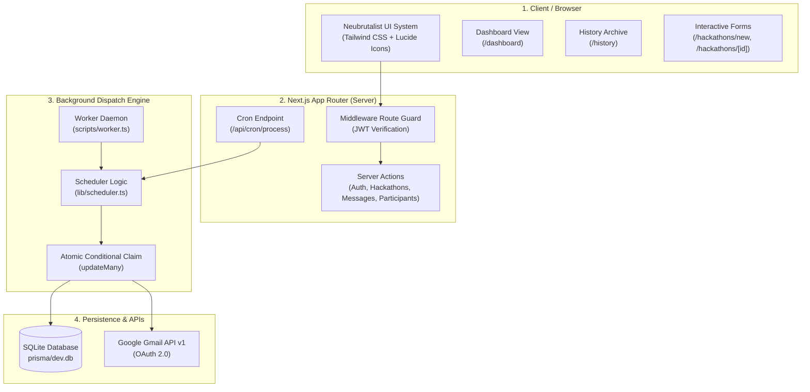
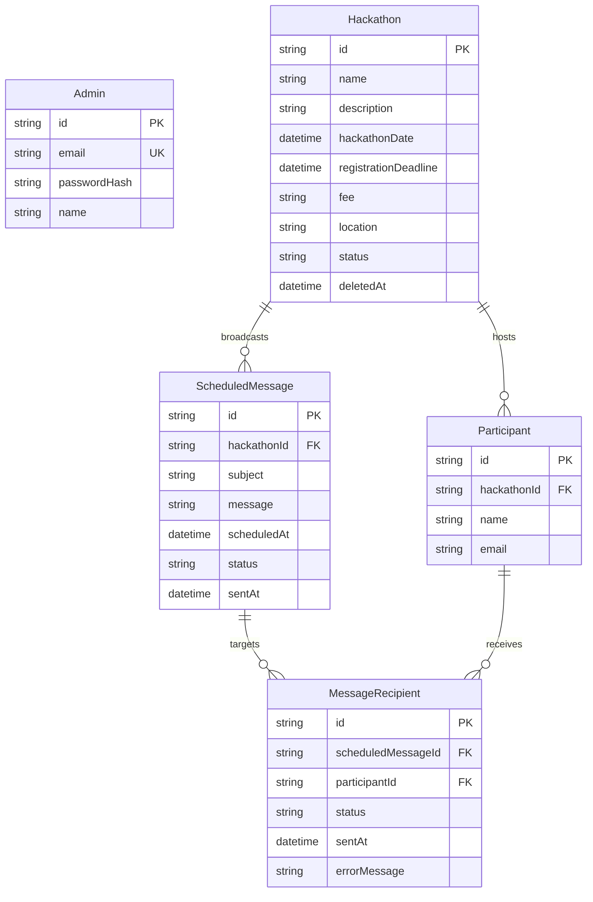

# ⚡ HackTrack — Neubrutalist Hackathon Command Center & Automated Broadcast Engine

> A high-velocity hackathon administration hub and automated participant email broadcast platform built with Next.js 16, Prisma ORM, SQLite, and an independent background scheduling daemon.

---

## 🌟 Overview

**HackTrack** is designed for hackathon organizers and university tech communities who require precision management over multi-stage hackathons, participant rosters, and scheduled communication broadcasts.

Built with a bold **Neubrutalist** aesthetic—featuring high-contrast color palettes, hard geometric drop shadows, thick black borders, and functional monospace typography—HackTrack delivers both raw visual impact and enterprise-grade reliability.

---

## 🚀 Key Features

### 1. 🎛️ Administrator Command Center
* **Real-time KPI Tracking**: Live metrics for total hackathons added, upcoming events, registered developers, and broadcast dispatches.
* **Month-Grouped Upcoming Grids**: Hackathons taking place in the future are dynamically clustered into responsive 3-column month grids based on their actual event dates.
* **Chronological Activity Log**: High-density timeline tracking when hackathons were entered into the system.

### 2. 📜 Complete History & Audit Log (`/history`)
* **Instant Search & Filter**: Real-time client-side search across hackathon names, descriptions, and locations.
* **Multi-Dimensional Filters**: Filter by creation month (`All Time`, `October 2026`, etc.) and status (`Active`, `Upcoming`, `Completed`, `Flagged`, `Removed`).
* **Soft Deletion & State Lifecycle**: Entries can be soft-deleted (`REMOVED`), flagged (`FLAGGED`), or restored back to active state without losing historical records.
* **Responsive Presentation**: Rich data table on desktop with quick action dropdown menus (`•••`) and card layout on mobile devices.
* **Neubrutalist Confirmation Modals**: Esc-key and backdrop-aware accessible modal dialogs for destructive actions.

### 3. 📧 Automated Email Broadcast Engine
* **Date & Time Scheduling**: Schedule broadcasts to go out at exact future timestamps.
* **Recipient Isolation & Privacy**: Every participant receives their own independent email. Recipient addresses are never grouped or exposed to others.
* **Template Token Interpolation**: Dynamic personalized tokens (e.g., `{name}` and `{hackathonName}`) are automatically replaced per recipient at dispatch time.
* **Multi-Worker Concurrency Protection**: Atomic conditional claims (`updateMany({ status: "SCHEDULED" } -> "SENDING")`) prevent duplicate deliveries even when multiple worker processes or cron jobs execute simultaneously.
* **Failure Fault Tolerance**: Individual recipient delivery errors are logged with error messages without failing the rest of the batch.

### 4. 🔄 Independent Background Worker Daemon
* Completely decoupled Node.js process (`npm run worker`) that polls the database every 15 seconds.
* Runs continuously in the background, unaffected by whether the administrator is logged in or if browser windows are open.

### 5. 🔒 Security & Authentication
* **10-Round Bcrypt** password hashing for administrator accounts.
* **State-of-the-Art JWT** session tokens generated using `jose` with `HS256`, 7-day expiration, and `httpOnly` / `sameSite: lax` cookie protection.
* **Protected Routes**: Next.js middleware guards `/dashboard`, `/hackathons`, `/history`, and `/settings`.
* **Database-Level Integrity**: Native SQLite and Prisma `@@unique([hackathonId, email])` constraint prevents duplicate registrations.
* **Protected Cron Endpoint**: `/api/cron/process` requires authorization via `CRON_SECRET`.

---

## 🛠️ Tech Stack

| Layer | Technology |
|---|---|
| **Framework** | [Next.js 16](https://nextjs.org/) (App Router + Turbopack) |
| **Language** | [TypeScript 5](https://www.typescriptlang.org/) |
| **Styling** | [Tailwind CSS v4](https://tailwindcss.com/) (Custom Neubrutalism Tokens) |
| **Database** | [SQLite](https://www.sqlite.org/) via [Prisma ORM 6](https://www.prisma.io/) |
| **Authentication** | [Jose](https://github.com/panva/jose) (JWT) + [Bcrypt.js](https://github.com/dcodeIO/bcrypt.js) |
| **Email Dispatch** | [Google APIs](https://github.com/googleapis/google-api-nodejs-client) (OAuth 2.0 Gmail API) + Offline Simulator |
| **Icons** | [Lucide React](https://lucide.dev/) |
| **Notifications** | [Sonner](https://sonner.emilkowal.ski/) |

---

## 🏗️ Architecture & Data Model



### Entity Relationship Diagram (ERD)



---

## ⚡ Quickstart Guide

### 1. Prerequisites
* **Node.js** (v20.x or higher)
* **npm** (v10.x or higher)

### 2. Clone & Install
```bash
git clone https://github.com/mujahiddxd/Hacktrack.git
cd Hacktrack/hacktrack
npm install
```

### 3. Configure Environment Variables
Copy the template configuration:
```bash
cp .env.example .env
```
Default `.env` configuration:
```env
DATABASE_URL="file:./dev.db"
JWT_SECRET="hacktrack-neubrutalism-super-secure-key-2026"
ADMIN_EMAIL="admin@hacktrack.com"
ADMIN_PASSWORD="adminpassword123"
CRON_SECRET="hacktrack-cron-super-secret-2026"
NEXT_PUBLIC_APP_URL="http://localhost:3000"
GOOGLE_CLIENT_ID=""
GOOGLE_CLIENT_SECRET=""
GOOGLE_REDIRECT_URI="http://localhost:3000/api/auth/google/callback"
```

### 4. Initialize Database & Seed Sample Data
```bash
# Push Prisma schema to SQLite
npx prisma db push

# Seed initial admin and demo hackathons
npm run seed
```

### 5. Launch the Platform
In **Terminal 1** — Start the Next.js web application:
```bash
npm run dev
```
Open **[http://localhost:3000](http://localhost:3000)** in your browser.

In **Terminal 2** — Start the background email worker:
```bash
npm run worker
```

### 6. Default Login Credentials
* **Email:** `admin@hacktrack.com`
* **Password:** `adminpassword123`

---

## 🧪 Verification & Audit Reports

The codebase has undergone two rigorous full-system audits verifying 26 backend security and reliability vectors:
* **[Initial Audit Report](BACKEND_TEST_REPORT.md)** — Baseline assessment covering database, authentication, and scheduler checks.
* **[V2 Verification Report](BACKEND_TEST_REPORT_V2.md)** — Comprehensive post-fix verification testing atomic claims under 4 concurrent worker processes, database-level unique constraints, and `CRON_SECRET` route protections.

---

## 📂 Project Structure

```text
HackTrack/
├── BACKEND_TEST_REPORT.md        # Initial backend audit report
├── BACKEND_TEST_REPORT_V2.md     # Post-fix secondary audit report
├── CURRENT_FRONTEND.md           # Comprehensive frontend architecture documentation
├── system_archi.md               # Technical system architecture specification
├── .gitignore                    # Root repository ignore rules
├── README.md                     # Root project guide
└── hacktrack/                    # Next.js Application Root
    ├── actions/                  # Next.js Server Actions (Auth, Hackathons, Messages, Participants)
    ├── app/                      # Next.js App Router (Dashboard, History, Settings, Login, APIs)
    │   ├── api/cron/process/     # Protected cron message processing route
    │   ├── api/auth/google/      # Google OAuth callback handler
    │   ├── dashboard/            # Command center view
    │   ├── hackathons/           # Hackathon directory & dynamic detail views
    │   └── history/              # Searchable audit archive
    ├── components/               # React components (DashboardContent, HistoryContent, Navbar, ConfirmDialog)
    ├── lib/                      # Core libraries (Prisma client, Auth JWT/Bcrypt, Scheduler, Gmail API)
    ├── prisma/                   # Schema definition & database seeds
    │   └── schema.prisma         # Models, indexes, and constraints
    ├── scripts/                  # Background worker & verification test scripts
    │   └── worker.ts             # 15s polling daemon
    ├── .env.example              # Environment variables template
    └── package.json              # Project dependencies and scripts
```

---

## 📄 License

This project is licensed under the [MIT License](LICENSE).
