# CURRENT VISUAL HIERARCHY SPECIFICATION

> **Document Status:** Comprehensive Empirical Specification of Existing HackTrack Frontend  
> **Source Evidence Base:** `hacktrack/app/**`, `hacktrack/components/**`, `hacktrack/lib/**`, and active TypeScript / Tailwind source files.  
> **Analytical Scope:** 100% observational. Contains zero redesign suggestions, zero hypothetical components, and zero speculative refactoring. All measurements, Tailwind utilities, color tokens, and typographic scale progressions are extracted directly from the repository source code.  
> **Golden Ratio Typographic Framework:** The typographic hierarchy and text differences strictly follow the **Golden Ratio** ($\phi \approx 1.618034$) and its harmonic square-root step ($\sqrt{\phi} \approx 1.272020$).

---

# 1. GLOBAL LAYOUT

The global application layout shell is defined in `hacktrack/app/layout.tsx` and wraps all rendered application routes.

```text
RootLayout (app/layout.tsx)
│
├── <html> <body className="min-h-[100dvh] bg-[#FEFDF8] text-[#121212] antialiased">
│   ├── Sticky Top Navbar (components/Navbar.tsx) [Conditional: Self-hides on /login]
│   ├── Main Content Container (<main className="max-w-7xl mx-auto px-4 lg:px-8 py-8">)
│   │   └── Active Page Route Component
│   └── Client Toast Layer (components/ToasterClient.tsx -> sonner <Toaster />)
```

### 1.1 Root Layout Shell
- **HTML & Body Attributes:** `<html lang="en">`, `<body className="...">`.
- **Canvas Base:** Background color `--color-canvas: #FEFDF8` with dark text `--color-neutral-dark: #121212`.
- **Layout Constraints:** The inner `<main>` container is centered with `max-w-7xl mx-auto px-4 lg:px-8 py-8`.

### 1.2 Sticky Top Navigation Header (`components/Navbar.tsx`)
- **Position & Sticky Behavior:** `sticky top-0 z-50 bg-[#FEFDF8] border-b-3 border-[#121212] px-4 lg:px-8 py-3.5`. Sits permanently fixed at viewport top during scroll.
- **Header Height:** `68px` total rendered height (including 3px solid black border).
- **Logo & Branding (Left):**
  - Anchor: `Link href="/dashboard"` with `group` hover transition.
  - Icon Badge: `w-10 h-10 bg-[#FFEB3B] border-3 border-[#121212] shadow-brutal-sm flex items-center justify-center font-black text-lg group-hover:-translate-y-0.5 transition-transform` containing text "HT".
  - Text Group: `flex flex-col` with Title (`font-black text-xl tracking-tight text-[#121212]`) and Subtitle (`text-[10px] font-mono uppercase tracking-widest text-[#71717A] -mt-1 font-bold` displaying "COMMAND CENTER").
- **Current Navigation Items (Center, `hidden md:flex items-center gap-2`):**
  1. **Dashboard:** `href="/dashboard"`, Icon: `Terminal (w-4 h-4)`
  2. **Hackathons:** `href="/hackathons"`, Icon: `Calendar (w-4 h-4)`
  3. **AI Add:** `href="/ai-add"`, Icon: `Sparkles (w-4 h-4)`
  4. **History:** `href="/history"`, Icon: `History (w-4 h-4)`
  5. **Test Email:** `href="/test-email"`, Icon: `Mail (w-4 h-4)`
  6. **Settings:** `href="/settings"`, Icon: `Settings (w-4 h-4)`
- **Active vs Inactive States:**
  - *Active Item:* `bg-[#FFEB3B] border-[#121212] shadow-brutal-sm text-[#121212] px-3.5 py-1.5 rounded-lg font-bold text-sm border-2`
  - *Inactive Item:* `text-[#121212] hover:bg-neutral-100 hover:border-[#121212] px-3.5 py-1.5 rounded-lg font-bold text-sm border-2 border-transparent transition-all`
- **Actions & Identity Layer (Right):**
  - Primary CTA: `Link href="/hackathons/new"` with `Button size="sm" variant="mint"` (`bg-[#00E676] border-3 shadow-brutal text-[#121212] font-bold text-xs`) featuring `Plus (w-4 h-4)`. Hidden on mobile viewports (`hidden sm:inline-flex`).
  - Admin Email Chip: `hidden lg:flex items-center gap-1.5 px-2.5 py-1 bg-white border-2 border-[#121212] rounded-md text-xs font-mono font-bold text-[#121212]` with green pulse indicator `span.w-2.h-2.rounded-full.bg-[#00E676]`.
  - Logout Trigger: Form invoking `logoutAction` with `button.brutal-btn.bg-white.hover:bg-[#FF5252].hover:text-white.p-2.rounded-lg` with `LogOut (w-4 h-4)`.
- **Mobile Navigation Behavior:**
  - Breakpoint: `< 768px` (`hidden md:flex`).
  - Links row is hidden from top header on small viewports to maintain compact brand/action layout.

---

# 2. DESIGN SYSTEM

Extracted directly from `hacktrack/app/globals.css` and primitives in `hacktrack/components/ui/`:

### 2.1 Colors
- **Canvas / App Background:** `--color-canvas: #FEFDF8` (Off-white, low fatigue).
- **Primary Yellow:** `--color-primary-yellow: #FFEB3B` (Overview card, brand emblem, primary CTAs).
- **Secondary Coral:** `--color-secondary-coral: #FF5252` (Destructive buttons, date conflict warnings, error boxes).
- **Tertiary Blue:** `--color-tertiary-blue: #2196F3` (Informational chips, event fees, active secondary states).
- **Accent Mint:** `--color-accent-mint: #00E676` (Confirmations, active health badges, New Hackathon CTA).
- **Neutral Dark (Ink):** `--color-neutral-dark: #121212` (Borders, brutal drop-shadows, main headings).
- **Neutral Muted:** `--color-neutral-muted: #71717A` (Captions, helper text, timestamps).
- **Neutral Light:** `--color-neutral-light: #F4F4F5` (Secondary backgrounds, inactive button states).
- **Card Surface:** `#FFFFFF` (Pure white inside cards and inputs).

### 2.2 Borders & Radius
- Major Card/Button Border: `3px solid #121212` (`.brutal-border`, `border-3 border-[#121212]`).
- Minor Input/Badge Border: `2px solid #121212` (`.brutal-border-2`, `border-2 border-[#121212]`).
- Internal Dividers: `border-b-2 border-[#121212]`, `border-t-2 border-[#121212]`, `border-b-3 border-[#121212]`.
- Corner Radii: `rounded-md` ($6\text{px}$), `rounded-lg` ($8\text{px}$), `rounded-xl` ($12\text{px}$), `rounded-2xl` ($16\text{px}$).

### 2.3 Shadows
- `--shadow-brutal-sm`: `2px 2px 0px #121212` (Badges, icon boxes, small buttons).
- `--shadow-brutal`: `4px 4px 0px #121212` (Standard cards, primary buttons, modal cards).
- `--shadow-brutal-lg`: `6px 6px 0px #121212` (Elevated modals).
- `--shadow-brutal-xl`: `8px 8px 0px #121212` (Deep focus states).

### 2.4 Tactile States
- **Button Hover:** `transform: translate(-1px, -1px); box-shadow: 5px 5px 0px #121212;`
- **Button Active:** `transform: translate(2px, 2px); box-shadow: 1px 1px 0px #121212;`
- **Button Disabled:** `opacity: 0.55; cursor: not-allowed; transform: none; box-shadow: 2px 2px 0px #121212;`
- **Input Focus:** `outline: none; box-shadow: 3px 3px 0px #121212;`
- **Card Hover:** `hover:-translate-y-1 transition-transform` (used on dashboard and directory cards).
- **Loading State:** Lucide `Loader2.w-3.5.h-3.5.animate-spin` or Sonner toast loading bar.

---

# 3. PAGE ANALYSIS (ALL CURRENT PAGES)

---

### PAGE: Root Redirector
* **Route:** `/`
* **Source:** `app/page.tsx`
* **Render Type:** Server Component

#### 1. Content Priority
- **Primary Content:** Functional redirect logic based on `getSession()`.
- **Primary CTA:** None.

#### 2. Component Tree
```text
HomePage (app/page.tsx)
└── getSession() -> redirect("/dashboard" | "/login")
```

#### 3. Components Inside File
- Server Component invoking `getSession()` from `lib/auth.ts` and Next.js `redirect()` from `next/navigation`.

#### 4. Exact Component Placement
- Non-rendered route; returns redirect header.

#### 5. Visual Order
- Instant server-side redirect; no persistent DOM.

#### 6. Page Wireframe
```text
[Instant Server Redirect: Authenticated -> /dashboard | Unauthenticated -> /login]
```

---

### PAGE: Admin Login
* **Route:** `/login`
* **Source:** `app/login/page.tsx`
* **Render Type:** Client Component (`"use client"`)

#### 1. Content Priority
- **Primary Content:** Admin Authentication Box (`brutal-card rounded-2xl bg-white p-6 md:p-8`).
- **Secondary Content:** Brand identity emblem (`w-16 h-16 bg-[#FFEB3B]` + "HACKTRACK" H1).
- **Tertiary Content:** Default seed hint / security note.
- **Primary CTA:** "Enter Command Center" button (`variant="primary" size="lg"`).
- **Secondary CTA:** None.

#### 2. Component Tree
```text
LoginPage
└── Container (min-h-[85dvh] flex flex-col items-center justify-center)
    └── Wrapper (w-full max-w-md)
        ├── BrandHeader (text-center mb-8)
        │   ├── LogoBadge (w-16 h-16 bg-[#FFEB3B] border-3 shadow-brutal font-black text-2xl)
        │   ├── Heading1 ("HACKTRACK", text-3xl md:text-4xl font-black tracking-tight)
        │   └── Subtitle ("Sign in to your Administrator Command Center", text-sm font-bold text-[#71717A])
        └── LoginCard (brutal-card rounded-2xl p-6 md:p-8 bg-white)
            ├── BadgeContainer (inline-flex bg-[#FFEB3B] border-2 shadow-brutal-sm text-xs font-mono font-bold uppercase)
            │   ├── LockIcon (w-3.5 h-3.5)
            │   └── Text ("Admin Authentication")
            ├── [ErrorAlert] (conditional: state?.error, bg-[#FF5252]/15 border-2 border-[#FF5252] text-xs font-bold text-[#FF5252])
            └── Form (action={formAction} space-y-4)
                ├── Input (name="email", label="Admin Email", type="email", required)
                ├── Input (name="password", label="Password", type="password", required)
                └── SubmitButton (Button variant="primary" size="lg" className="w-full gap-2 font-black text-base")
```

#### 3. Components Inside File
- `Button` (`components/ui/button.tsx`): Shared primitive, props: `type="submit"`, `variant="primary"`, `size="lg"`, `disabled={isPending}`.
- `Input` (`components/ui/input.tsx`): Shared primitive, props: `label`, `type`, `name`, `required`, `autoComplete`.
- Lucide Icons: `ArrowRight` (button child), `Lock` (badge child).
- Server Action: `loginAction` wired via React 19 `useActionState(loginAction, null)`.

#### 4. Exact Component Placement
- Centering: `min-h-[85dvh] flex flex-col items-center justify-center py-12 px-4`.
- Card Constraints: `w-full max-w-md`.
- Form Inputs: Vertical stack with `space-y-4`.
- Submit Button: Full-width container `pt-2`.

#### 5. Visual Order
1. 64x64px Yellow Emblem with bold "HT".
2. 36px "HACKTRACK" H1 title.
3. Yellow "Admin Authentication" lock badge.
4. Admin Email field.
5. Password field.
6. Full-width yellow "Enter Command Center" button.

#### 6. Page Wireframe
```text
┌─────────────────────────────────────────────────────────┐
│                                                         │
│                        ┌───────┐                        │
│                        │  HT   │                        │
│                        └───────┘                        │
│                        HACKTRACK                        │
│       Sign in to your Administrator Command Center      │
│                                                         │
│              ┌───────────────────────────┐              │
│              │ [🔒 Admin Authentication] │              │
│              │                           │              │
│              │ ADMIN EMAIL               │              │
│              │ [ admin@hacktrack.com   ] │              │
│              │                           │              │
│              │ PASSWORD                  │              │
│              │ [ ••••••••••••••••••••• ] │              │
│              │                           │              │
│              │ [ Enter Command Center >] │              │
│              └───────────────────────────┘              │
│                                                         │
└─────────────────────────────────────────────────────────┘
```

---

### PAGE: Dashboard
* **Route:** `/dashboard`
* **Source:** `app/dashboard/page.tsx` & `components/DashboardContent.tsx`
* **Render Type:** Server Component fetching data, delegating to Client Component (`DashboardContent`)

#### 1. Content Priority
- **Primary Content:** Hero Section with date badge, bold headline ("Your next big thing starts here."), subtitle, and dual-window SVG illustration.
- **Secondary Content:** Upcoming Hackathons section (3-column responsive grid) with "View all →" directory link.
- **Tertiary Content:** Individual Hackathon Event cards with UPCOMING badge, short uppercase date, location/deadline subtitle, participant count, and arrow affordance.
- **Primary CTA:** "+ New Hackathon" primary yellow button (`bg-[#FFEB3B]`).
- **Secondary CTA:** "Import with AI" outline button (`bg-white`).

#### 2. Component Tree
```text
DashboardPage (Server Component)
└── DashboardContent (Client Component)
    ├── HeroSection (flex flex-col lg:flex-row justify-between gap-8 pt-4 sm:pt-6)
    │   ├── HeroLeftContent (max-w-xl)
    │   │   ├── DateBadge (text-xs sm:text-sm font-bold font-mono tracking-wider text-[#71717A] uppercase)
    │   │   ├── Heading1 ("Your next big thing starts here.", text-3xl sm:text-4xl md:text-5xl font-black text-[#121212])
    │   │   ├── Subtitle ("All your hackathons, deadlines, and participants in one place.", text-sm sm:text-base font-semibold)
    │   │   └── ActionButtonGroup (flex flex-wrap items-center gap-3.5 mt-6)
    │   │       ├── CreateHackathonLink (Link -> button.brutal-btn.bg-[#FFEB3B] "+ New Hackathon")
    │   │       └── AiImportLink (Link -> button.brutal-btn.bg-white "Import with AI" + Sparkles)
    │   └── HeroRightIllustration (svg dual-window illustration with burst lines and yellow [HT] badge)
    │
    ├── ThinDivider (w-full border-t border-[#121212]/20 my-6 sm:my-8)
    │
    ├── UpcomingHackathonsSection (space-y-5 sm:space-y-6)
    │   ├── SectionHeader (flex items-center justify-between)
    │   │   ├── Heading2 ("Upcoming Hackathons", text-xl sm:text-2xl font-black text-[#121212])
    │   │   └── ViewAllLink (Link -> "View all →" text-xs sm:text-sm font-bold)
    │   └── CardsGrid (grid grid-cols-1 md:grid-cols-2 lg:grid-cols-3 gap-5)
    │       └── HackathonCard[] (Link -> brutal-card rounded-xl p-5 bg-white border-2 border-[#121212] shadow-brutal-sm)
    │           ├── TopRow (UPCOMING badge [blue/mint], formatShortDate "OCT 12")
    │           ├── Title (h3.font-black.text-lg)
    │           ├── SubtitleLine ("Location · Registration closes Date" or "Registration open")
    │           └── BottomRow (Users icon + count participants, Right Arrow affordance "→")
    │
    └── GetStartedSection (brutal-card rounded-2xl p-5 sm:p-6 bg-[#FEFDF8] border-2 border-[#121212] shadow-brutal-sm)
        ├── SectionHeader
        │   ├── Heading2 ("Get started with HackTrack", text-xl sm:text-2xl font-black text-[#121212])
        │   └── Description ("A simple workflow to keep every event organized.")
        └── StepsList (space-y-4 sm:space-y-5)
            ├── Step1 (Link -> /hackathons/new, Yellow Tile w-11 h-11 bg-[#FFEB3B], CalendarPlus icon)
            ├── Step2 (Link -> /hackathons, Blue Tile w-11 h-11 bg-[#DDEBFF], Users icon)
            └── Step3 (Link -> /hackathons/[id], Mint Tile w-11 h-11 bg-[#DCFCE7], Mail icon)
```

#### 3. Components Inside File
- HTML Button primitives with `.brutal-btn` styling.
- Icons: `Users`, `Plus`, `Sparkles`, `CalendarPlus`, `Mail`.
- Data Passed: `allHackathons` (Hackathon array), `scheduledMessagesCount` (number), `sentMessagesCount` (number), `googleAccount` (object).

#### 4. Exact Component Placement
- Hero Section: `flex flex-col lg:flex-row items-start lg:items-center justify-between gap-8 pt-4 sm:pt-6`.
- Divider: `w-full border-t border-[#121212]/20 my-6 sm:my-8`.
- Upcoming Grid: `grid grid-cols-1 md:grid-cols-2 lg:grid-cols-3 gap-5`.
- Get Started Guide: `brutal-card rounded-2xl p-5 sm:p-6 bg-[#FEFDF8] border-2 border-[#121212] shadow-brutal-sm`.

#### 5. Visual Order
1. Sticky Navbar (Desktop: text links with active yellow bottom line; Tablet/Mobile: hamburger menu dropdown).
2. Uppercase Date Badge (`THURSDAY, OCTOBER 1`).
3. 48px/36px "Your next big thing starts here." H1 title.
4. Yellow "+ New Hackathon" and white "Import with AI" CTAs.
5. Dual-window HackTrack SVG illustration.
6. Thin horizontal divider line.
7. "Upcoming Hackathons" H2 heading and "View all →" link.
8. 3-column Upcoming Hackathon cards.
9. "Get started with HackTrack" 3-step guide card.

#### 6. Page Wireframe
```text
┌─────────────────────────────────────────────────────────────────────────────┐
│ [HT] HACKTRACK   Dashboard  Hackathons  History  Settings   [+ New Hackathon] (8)│
├─────────────────────────────────────────────────────────────────────────────┤
│ THURSDAY, OCTOBER 1                                                         │
│ Your next big thing starts here.                 \ | /                      │
│ All your hackathons, deadlines, and              ┌──[..]──────┐             │
│ participants in one place.                       │ ┌──[..]──┐ │ (Blue)      │
│                                                  │ │HACKATHON││             │
│ [+ New Hackathon]   [✦ Import with AI]           │ │==   [HT]││             │
│                                                  │ └────────┘ │             │
│                                                  └────────────┘             │
├─────────────────────────────────────────────────────────────────────────────┤
│ Upcoming Hackathons                                               View all →│
│ ┌────────────────────────┐ ┌────────────────────────┐ ┌───────────────────┐ │
│ │ [UPCOMING]       OCT 12│ │ [UPCOMING]       OCT 22│ │ [UPCOMING]   NOV 15│ │
│ │ AI Hack 2026           │ │ CodeStorm 2026         │ │ AI Dev Summit     │ │
│ │ Online · Reg closes... │ │ Mumbai · Reg open      │ │ Bengaluru · Reg open│
│ │ ────────────────────── │ │ ────────────────────── │ │ ───────────────── │ │
│ │ 👥 24 participants    →│ │ 👥 8 participants     →│ │ 👥 14 participants →│ │
│ └────────────────────────┘ └────────────────────────┘ └───────────────────┘ │
│                                                                             │
│ ┌─────────────────────────────────────────────────────────────────────────┐ │
│ │ Get started with HackTrack                                              │ │
│ │ A simple workflow to keep every event organized.                        │ │
│ │                                                                         │ │
│ │ [📅+] 1. Create an event                                                │ │
│ │      Enter hackathon dates, rounds, fees, and registration details.     │ │
│ │                                                                         │ │
│ │ [👥 ] 2. Add participants                                               │ │
│ │      Keep participant names and email addresses organized per event.    │ │
│ │                                                                         │ │
│ │ [✉️ ] 3. Schedule updates                                               │ │
│ │      Prepare messages and choose when they should be sent.              │ │
│ └─────────────────────────────────────────────────────────────────────────┘ │
└─────────────────────────────────────────────────────────────────────────────┘
```

---

### PAGE: Hackathons Directory
* **Route:** `/hackathons`
* **Source:** `app/hackathons/page.tsx`
* **Render Type:** Server Component (`force-dynamic`)

#### 1. Content Priority
- **Primary Content:** 3-column responsive grid of Hackathon Cards.
- **Secondary Content:** Directory header with total active counter.
- **Tertiary Content:** Fee badges, participant counts, and deadlines.
- **Primary CTA:** "+ Create Hackathon" button (`variant="primary" size="lg"` in header).
- **Secondary CTA:** "Manage ->" outline button on each card.

#### 2. Component Tree
```text
HackathonsPage
├── PageHeader (flex flex-col sm:flex-row sm:items-center justify-between gap-4 pb-6 border-b-3)
│   ├── TitleContainer
│   │   ├── Heading1 ("Hackathons Directory", text-3xl font-black text-[#121212])
│   │   └── Subtitle (text-sm font-bold text-[#71717A] mt-1)
│   └── CreateButton (Link -> Button variant="primary" size="lg" font-black with Plus icon)
│
└── DirectoryGrid (grid grid-cols-1 md:grid-cols-2 lg:grid-cols-3 gap-6)
    └── HackathonCard[] (brutal-card rounded-2xl p-6 bg-white hover:-translate-y-1)
        ├── StatusAndFeeRow (flex items-center justify-between gap-2 mb-3)
        │   ├── StatusBadge (Upcoming: variant="yellow" vs Past: variant="outline")
        │   └── FeeBadge (variant="blue" font-mono)
        ├── Title (h2.text-xl.font-black.text-[#121212].tracking-tight.line-clamp-1)
        ├── Description (text-xs text-[#71717A] font-medium line-clamp-3 mb-4)
        ├── EventDatesAndLocation (space-y-2 pt-4 border-t-2 border-[#121212] text-xs font-mono)
        │   ├── EventDateRow (Calendar icon, formatDate)
        │   ├── DeadlineRow (Clock icon, formatDate)
        │   └── LocationRow (MapPin icon, location)
        └── ActionFooter (pt-4 border-t-2 border-[#121212] flex items-center justify-between)
            ├── CountersRow (Pill tags: Users icon + count, Send icon + count)
            └── ManageLink (Link -> Button variant="outline" size="sm" with ArrowRight icon)
```

#### 3. Components Inside File
- `Button` (`components/ui/button.tsx`): Header primary CTA and card Manage buttons.
- `Badge` (`components/ui/badge.tsx`): Status and fee badges.
- Icons: `Plus`, `Calendar`, `Users`, `Send`, `MapPin`, `Clock`, `ArrowRight`, `ExternalLink`.
- Data Passed: Result of `getHackathons()` Server Action.

#### 4. Exact Component Placement
- Header: `pb-6 border-b-3 border-[#121212] flex justify-between`.
- Grid: `grid grid-cols-1 md:grid-cols-2 lg:grid-cols-3 gap-6`.
- Card internal padding: `p-6`.

#### 5. Visual Order
1. Sticky Navbar.
2. 30px "Hackathons Directory" H1.
3. Yellow "+ Create Hackathon" large CTA.
4. Responsive cards: Status badge -> Title -> Description -> Dates -> Manage button.

#### 6. Page Wireframe
```text
┌─────────────────────────────────────────────────────────────────────────────┐
│ [HT] HACKTRACK                                                 [+ New] (Ad)│
├─────────────────────────────────────────────────────────────────────────────┤
│ Hackathons Directory                                                        │
│ Create, manage, and broadcast to participants (3 active)      [+ Create]    │
│ ─────────────────────────────────────────────────────────────────────────── │
│ ┌────────────────────────┐ ┌────────────────────────┐ ┌───────────────────┐ │
│ │ [Upcoming]    [Free]   │ │ [Upcoming]    [₹500]   │ │ [Upcoming] [Free] │ │
│ │ CodeStorm 2026         │ │ InnovateX 2026         │ │ BioHack 2026      │ │
│ │ Multi-tier building... │ │ Health & Biotech hack..│ │ Smart contracts.. │ │
│ │ ────────────────────── │ │ ────────────────────── │ │ ───────────────── │ │
│ │ Event: Oct 30, 2026    │ │ Event: Nov 20, 2026    │ │ Event: Dec 05,2026│ │
│ │ Reg: Oct 28, 2026      │ │ Reg: Nov 15, 2026      │ │ Reg: Dec 01, 2026 │ │
│ │ Loc: Bangalore / Discord│ │ Loc: Hybrid Venue     │ │ Loc: Online Hub   │ │
│ │ ────────────────────── │ │ ────────────────────── │ │ ───────────────── │ │
│ │ [👥 42] [✉️ 2] [Manage >]│ │ [👥 18] [✉️ 1] [Manage >]│ │ [👥 5] [✉️ 0] [Manage│ │
│ └────────────────────────┘ └────────────────────────┘ └───────────────────┘ │
└─────────────────────────────────────────────────────────────────────────────┘
```

---

### PAGE: Create Hackathon
* **Route:** `/hackathons/new`
* **Source:** `app/hackathons/new/page.tsx`
* **Render Type:** Client Component (`"use client"`)

#### 1. Content Priority
- **Primary Content:** 3-section Creation Form (Details, Broadcast, Participants).
- **Secondary Content:** Live Date Conflict Alert HUD (`components/DateConflictAlert.tsx`).
- **Tertiary Content:** Helper text and format hints.
- **Primary CTA:** "Create Hackathon & Schedule Broadcast" button (`variant="primary" size="lg"`).
- **Secondary CTA:** "<- Back to Directory" navigation link and "Cancel" button.

#### 2. Component Tree
```text
NewHackathonPage
├── BackLink (Link -> "Back to Directory" with ArrowLeft icon)
├── FormCard (brutal-card rounded-2xl p-6 md:p-8 bg-white max-w-3xl mx-auto)
│   ├── CardHeader (flex items-center gap-3 pb-6 border-b-3 border-[#121212] mb-6)
│   │   ├── IconBox (w-12 h-12 bg-[#FFEB3B] border-3 shadow-brutal-sm font-black)
│   │   └── TitleBlock (h1.text-2xl.font-black, p.text-xs.font-bold.text-[#71717A])
│   ├── [ErrorBanner] (conditional)
│   └── Form (space-y-6 onSubmit={handleSubmit})
│       ├── Section 1: Hackathon Information
│       │   ├── SectionHeading ("1. Hackathon Information", Calendar icon)
│       │   ├── Input (name="name", label="Hackathon Name", required)
│       │   ├── Textarea (name="description", label="Description", required)
│       │   ├── Textarea (name="roundDetails", label="Round Details & Milestones (Optional)")
│       │   ├── DateFieldsGrid (grid grid-cols-1 md:grid-cols-2 gap-5)
│       │   │   ├── Input (name="hackathonDate", type="datetime-local", onChange={handleDateChange})
│       │   │   └── Input (name="registrationDeadline", type="datetime-local")
│       │   ├── DateConflictAlert (live status indicator or conflicting events card)
│       │   ├── LogisticsFieldsGrid (grid grid-cols-1 md:grid-cols-2 gap-5)
│       │   │   ├── Input (name="fee", defaultValue="Free")
│       │   │   └── Input (name="location", required)
│       │   └── Input (name="registrationLink", type="url")
│       ├── Section 2: Automated Broadcast
│       │   ├── SectionHeading ("2. Automated Participant Email Broadcast", Send icon)
│       │   ├── ToggleCheckbox ("Enable automated email broadcast")
│       │   ├── Input (name="broadcastSubject")
│       │   ├── Textarea (name="broadcastMessage")
│       │   └── Input (name="broadcastSendAt", type="datetime-local")
│       ├── Section 3: Initial Participants
│       │   ├── SectionHeading ("3. Pre-register Initial Participants (Optional)", Users icon)
│       │   └── Textarea (name="initialParticipants", placeholder="Alice, alice@test.com\nBob, bob@test.com")
│       └── SubmitActionBar (pt-6 border-t-2 border-[#121212] flex items-center justify-end gap-3)
│           ├── CancelLink (Link -> Button variant="outline")
│           └── SubmitButton (Button variant="primary" size="lg" font-black)
└── ConfirmDialog (modal dialog for date conflict override confirmation)
```

#### 3. Components Inside File
- `Button`, `Input`, `Textarea`, `Badge`: Shared primitives.
- `DateConflictAlert` (`components/DateConflictAlert.tsx`): Embedded inline below date fields.
- `ConfirmDialog` (`components/ConfirmDialog.tsx`): Overlay confirmation modal.
- Icons: `ArrowLeft`, `PlusCircle`, `Sparkles`, `Send`, `Users`, `Clock`, `Calendar`, `CheckCircle2`.

#### 4. Exact Component Placement
- Centered container: `max-w-3xl mx-auto space-y-6`.
- Card padding: `p-6 md:p-8`.
- Date inputs: `grid grid-cols-1 md:grid-cols-2 gap-5`.

#### 5. Visual Order
1. Sticky Navbar.
2. "<- Back to Directory" link.
3. Card Header: Yellow icon box and 24px "Create New Hackathon" H1.
4. Section 1 heading.
5. Hackathon Name input.
6. Event Date & Deadline inputs.
7. Real-time Date Conflict Alert card (animates in when conflicting dates exist).
8. Logistics inputs (Fee, Location, URL).
9. Section 2 (Automated Broadcast).
10. Section 3 (Pre-register Participants).
11. Submit Action Bar.

#### 6. Page Wireframe
```text
┌─────────────────────────────────────────────────────────────────────────────┐
│ <- Back to Directory                                                        │
│ ┌─────────────────────────────────────────────────────────────────────────┐ │
│ │ [ + ] Create New Hackathon                                              │ │
│ │ Fill in event details and configure automated email broadcast...        │ │
│ │ ─────────────────────────────────────────────────────────────────────── │ │
│ │ 1. HACKATHON INFORMATION                                                │ │
│ │ Hackathon Name: [_____________________________________________________] │ │
│ │ Description:    [_____________________________________________________] │ │
│ │ Round Details:  [_____________________________________________________] │ │
│ │ ┌───────────────────────────────────┐ ┌───────────────────────────────┐ │ │
│ │ │ Event Date: [ 2026-10-30 09:00  ] │ │ Deadline: [ 2026-10-28 23:59 ]│ │ │
│ │ └───────────────────────────────────┘ └───────────────────────────────┘ │ │
│ │ ┌─────────────────────────────────────────────────────────────────────┐ │ │
│ │ │ ⚠️ DATE CONFLICT ALERT: 1 hackathon registered on this date!         │ │ │
│ │ │ • CodeStorm 2026 [Free] | 09:00 AM | Bangalore Hub    [View Event ↗]│ │ │
│ │ └─────────────────────────────────────────────────────────────────────┘ │ │
│ │ ┌───────────────────────────────────┐ ┌───────────────────────────────┐ │ │
│ │ │ Fee:        [ Free              ] │ │ Location: [ Bangalore Hub   ] │ │ │
│ │ └───────────────────────────────────┘ └───────────────────────────────┘ │ │
│ │ 2. AUTOMATED BROADCAST                                                  │ │
│ │ [x] Enable automated email broadcast                                    │ │
│ │ Subject: [ Welcome to the Hackathon!                                  ] │ │
│ │ Message: [ We are thrilled to invite you...                           ] │ │
│ │ Send At: [ 2026-10-29 09:00                                           ] │ │
│ │ 3. PRE-REGISTER PARTICIPANTS                                            │ │
│ │ CSV/List: [ Alice Smith, alice@example.com                            ] │ │
│ │ ─────────────────────────────────────────────────────────────────────── │ │
│ │                                            [ Cancel ] [ Create Hackathon] │ │
│ └─────────────────────────────────────────────────────────────────────────┘ │
└─────────────────────────────────────────────────────────────────────────────┘
```

---

### PAGE: Hackathon Detail
* **Route:** `/hackathons/[id]`
* **Source:** `app/hackathons/[id]/page.tsx`
* **Render Type:** Server Component (`force-dynamic`)

#### 1. Content Priority
- **Primary Content:** Main Hackathon Hero Card with fees, dates, and locations.
- **Secondary Content:** Participant Manager panel (`components/ParticipantManager.tsx`).
- **Tertiary Content:** Message Scheduler & Delivery Logs (`components/MessageScheduler.tsx`).
- **Primary CTA:** "Edit Hackathon" button (`variant="primary" size="sm"`).
- **Secondary CTA:** "Public Link" button (`variant="outline"`), "+ Add Participant" drawer trigger.

#### 2. Component Tree
```text
HackathonDetailPage
├── BackLink (Link -> "Back to Hackathons" with ArrowLeft icon)
├── EventHeroCard (brutal-card rounded-2xl p-6 md:p-8 bg-white space-y-6)
│   ├── TopRow (flex flex-col md:flex-row md:items-start justify-between gap-4)
│   │   ├── TitleAndBadges (space-y-3)
│   │   │   ├── BadgesRow (Upcoming badge, Fee badge)
│   │   │   ├── Heading1 (hackathon.name, text-3xl md:text-4xl font-black text-[#121212])
│   │   │   └── Description (text-sm font-medium text-[#71717A] max-w-2xl)
│   │   └── ActionsButtonGroup (Public Link button, Edit Hackathon button)
│   ├── MetadataGrid (grid grid-cols-1 sm:grid-cols-3 gap-4 pt-6 border-t-2 border-[#121212])
│   │   ├── EventDateBox (Calendar icon in yellow box, 10px label, 14px date)
│   │   ├── DeadlineBox (Clock icon in blue box, 10px label, 14px date)
│   │   └── LocationBox (MapPin icon in mint box, 10px label, 14px location)
│   └── [RoundDetailsBox] (conditional: round details text, pt-4 border-t-2)
│
├── ParticipantManager (components/ParticipantManager.tsx)
│   ├── Header (Users icon in mint box, 20px title, count badge, "+ Add Participant" button)
│   ├── [AddParticipantDrawer] (conditional)
│   ├── SearchInput (Search icon, text-xs)
│   └── ParticipantsTable / List
│
└── MessageScheduler (components/MessageScheduler.tsx)
    ├── Header (Send icon in coral box, 20px title, "+ Schedule Broadcast" button)
    ├── [ComposerDrawer] (conditional)
    └── ScheduledMessagesList (MessageCard[] with delivery tags and recipient logs)
```

#### 3. Components Inside File
- `ParticipantManager`: Client Component handling CRUD participant operations.
- `MessageScheduler`: Client Component managing broadcast queue and dispatch logs.
- `Button`, `Badge`: Shared UI primitives.
- Icons: `Calendar`, `Clock`, `MapPin`, `ExternalLink`, `Edit3`, `ArrowLeft`, `Award`.
- Data Passed: `hackathon` record fetched by `getHackathonById(id)`.

#### 4. Exact Component Placement
- Vertical spacing: `space-y-8`.
- Metadata Grid: `grid grid-cols-1 sm:grid-cols-3 gap-4`.

#### 5. Visual Order
1. Sticky Navbar.
2. "<- Back to Hackathons" link.
3. Event Hero Card (36px Title, Status/Fee Badges, Edit button).
4. 3-column Metadata summary (Date, Deadline, Location).
5. Participant Manager panel.
6. Message Scheduler & broadcast status timeline.

#### 6. Page Wireframe
```text
┌─────────────────────────────────────────────────────────────────────────────┐
│ <- Back to Hackathons                                                       │
│ ┌─────────────────────────────────────────────────────────────────────────┐ │
│ │ [Upcoming] [Fee: Free]                            [Public Link] [Edit]  │ │
│ │ CodeStorm 2026                                                          │ │
│ │ Annual national software hackathon focusing on AI and distributed apps. │ │
│ │ ─────────────────────────────────────────────────────────────────────── │ │
│ │ ┌─────────────────────┐ ┌─────────────────────┐ ┌─────────────────────┐ │ │
│ │ │ [Cal] EVENT DATE    │ │ [Clock] DEADLINE    │ │ [Pin] LOCATION      │ │ │
│ │ │ Oct 30, 2026        │ │ Oct 28, 2026        │ │ Bangalore Hub       │ │ │
│ │ └─────────────────────┘ └─────────────────────┘ └─────────────────────┘ │ │
│ └─────────────────────────────────────────────────────────────────────────┘ │
│                                                                             │
│ ┌─────────────────────────────────────────────────────────────────────────┐ │
│ │ [👥] Participants  [42 Registered]                    [+ Add Participant]│ │
│ │ ─────────────────────────────────────────────────────────────────────── │ │
│ │ [ Search participants...                                              ] │ │
│ │ • Shaban Chaudhary   | shaban@hacktrack.com     | Oct 15, 2026   [Trash]│ │
│ │ • John Doe           | john@example.com         | Oct 16, 2026   [Trash]│ │
│ └─────────────────────────────────────────────────────────────────────────┘ │
│                                                                             │
│ ┌─────────────────────────────────────────────────────────────────────────┐ │
│ │ [✉️] Scheduled Broadcasts                          [+ Schedule Broadcast]│ │
│ │ ─────────────────────────────────────────────────────────────────────── │ │
│ │ • Welcome Announcement | [✓ Sent]     | 42 recipients | Oct 20   [View] │ │
│ │ • Round 1 Kickoff      | [● Scheduled]| 42 recipients | Oct 29 [Cancel] │ │
│ └─────────────────────────────────────────────────────────────────────────┘ │
└─────────────────────────────────────────────────────────────────────────────┘
```

---

### PAGE: Edit Hackathon
* **Route:** `/hackathons/[id]/edit`
* **Source:** `app/hackathons/[id]/edit/page.tsx` & `components/EditHackathonForm.tsx`
* **Render Type:** Server Component loading data, delegating to Client Form

#### 1. Content Priority
- **Primary Content:** Pre-filled Edit Form with date conflict checking.
- **Secondary Content:** Live Date Conflict Alert HUD (excluding self ID).
- **Tertiary Content:** Destructive Deletion button.
- **Primary CTA:** "Save Changes" button (`variant="primary" size="lg"`).
- **Secondary CTA:** "Delete Hackathon" destructive button (`variant="secondary" size="sm"`).

#### 2. Component Tree
```text
EditHackathonPage (Server Component)
└── EditHackathonForm (Client Component)
    ├── Header (flex items-center justify-between pb-6 border-b-3 border-[#121212])
    │   ├── IconAndTitle
    │   │   ├── IconBox (w-12 h-12 bg-[#2196F3] text-white border-3 shadow-brutal-sm)
    │   │   └── TitleBlock (h1.text-2xl.font-black, p.text-xs.font-bold.text-[#71717A])
    │   └── DeleteButton (Button variant="secondary" size="sm" with Trash2 icon)
    ├── [ErrorBanner] (conditional)
    ├── Form (space-y-6 onSubmit={handleSubmit})
    │   ├── Input (name="name", defaultValue={hackathon.name})
    │   ├── Textarea (name="description", defaultValue={hackathon.description})
    │   ├── Textarea (name="roundDetails", defaultValue={hackathon.roundDetails})
    │   ├── DateFieldsGrid (grid grid-cols-1 md:grid-cols-2 gap-5)
    │   │   ├── Input (name="hackathonDate", onChange={handleDateChange})
    │   │   └── Input (name="registrationDeadline")
    │   ├── DateConflictAlert (components/DateConflictAlert.tsx)
    │   ├── LogisticsGrid (grid grid-cols-1 md:grid-cols-2 gap-5)
    │   │   ├── Input (name="fee", defaultValue={hackathon.fee})
    │   │   └── Input (name="location", defaultValue={hackathon.location})
    │   ├── Input (name="registrationLink", defaultValue={hackathon.registrationLink})
    │   └── ActionBar (pt-6 border-t-2 border-[#121212] flex items-center justify-end gap-3)
    │       ├── CancelLink (Link -> Button variant="outline")
    │       └── SubmitButton (Button variant="primary" size="lg")
    └── ConfirmDialog (components/ConfirmDialog.tsx)
```

#### 3. Components Inside File
- `EditHackathonForm`: Client Component containing edit and delete handlers.
- `DateConflictAlert`: Validates updated date against database, excluding `hackathon.id`.
- `ConfirmDialog`: Used for duplicate override confirmation.
- `Button`, `Input`, `Textarea`: Shared primitives.
- Icons: `Edit`, `Trash2`, `CheckCircle2`.

#### 4. Exact Component Placement
- Container: `max-w-3xl mx-auto space-y-6`.
- Card: `brutal-card rounded-2xl p-6 md:p-8 bg-white`.

#### 5. Visual Order
1. Sticky Navbar.
2. Form Header (Blue edit icon + 24px Title) and Coral "Delete Hackathon" button.
3. Hackathon Name input.
4. Description and Round Details textareas.
5. Event Date & Deadline inputs.
6. Date Conflict Alert card (if conflict detected).
7. Fee & Location inputs.
8. Submit Action Bar ("Save Changes").

#### 6. Page Wireframe
```text
┌─────────────────────────────────────────────────────────────────────────────┐
│ ┌─────────────────────────────────────────────────────────────────────────┐ │
│ │ [ ✎ ] Edit Hackathon                                [ Delete Hackathon ]│ │
│ │ Modify dates, location, or round requirements.                          │ │
│ │ ─────────────────────────────────────────────────────────────────────── │ │
│ │ Hackathon Name: [ CodeStorm 2026                                      ] │ │
│ │ Description:    [ Annual national hackathon...                        ] │ │
│ │ Round Details:  [ Round 1: Idea Pitch...                              ] │ │
│ │ ┌───────────────────────────────────┐ ┌───────────────────────────────┐ │ │
│ │ │ Event Date: [ 2026-10-30 09:00  ] │ │ Deadline: [ 2026-10-28 23:59 ]│ │ │
│ │ └───────────────────────────────────┘ └───────────────────────────────┘ │ │
│ │ [✓ Date is clear! No hackathons registered on this date.              ] │ │
│ │ ┌───────────────────────────────────┐ ┌───────────────────────────────┐ │ │
│ │ │ Fee:        [ Free              ] │ │ Location: [ Bangalore Hub   ] │ │ │
│ │ └───────────────────────────────────┘ └───────────────────────────────┘ │ │
│ │ ─────────────────────────────────────────────────────────────────────── │ │
│ │                                                 [ Cancel ] [ Save Changes]│
│ └─────────────────────────────────────────────────────────────────────────┘ │
└─────────────────────────────────────────────────────────────────────────────┘
```

---

### PAGE: System Settings
* **Route:** `/settings`
* **Source:** `app/settings/page.tsx` & `components/GoogleConnectCard.tsx`
* **Render Type:** Server Component wrapping Client OAuth Manager

#### 1. Content Priority
- **Primary Content:** Google Mail OAuth Integration Card (`components/GoogleConnectCard.tsx`).
- **Secondary Content:** Background Worker & Cron Architecture status card.
- **Tertiary Content:** Google Cloud Console configuration guide.
- **Primary CTA:** "Connect Gmail with Google OAuth" button (`variant="primary"`).
- **Secondary CTA:** "Instant Demo Connect" button (`variant="outline"`).

#### 2. Component Tree
```text
SettingsPage
├── PageHeader (pb-6 border-b-3 border-[#121212])
│   ├── Heading1 ("System Settings & Integrations", text-3xl font-black text-[#121212])
│   └── Subtitle (text-sm font-bold text-[#71717A] mt-1)
│
├── GoogleConnectCard (components/GoogleConnectCard.tsx)
│   ├── CardHeader (Mail icon, 20px title, active/disconnected badge)
│   ├── [StatusBox] (Coral warning box if disconnected; Mint success box if active)
│   └── ActionButtonGroup
│       ├── [If Disconnected]: "Connect Gmail with Google OAuth" + "Instant Demo Connect"
│       └── [If Connected]: "Disconnect Account" button
│
├── WorkerStatusCard (brutal-card rounded-2xl p-6 md:p-8 bg-white space-y-4)
│   ├── CardHeader (Terminal icon in blue box, 18px title)
│   ├── MetricsBox (bg-neutral-50 border-2 rounded-xl text-xs font-mono space-y-2)
│   │   ├── WorkerPollingInterval ("15 Seconds")
│   │   ├── WorkerScript ("npm run worker")
│   │   ├── WebhookEndpoint ("/api/cron/process")
│   │   └── OAuthRefreshStatus ("Automatic via googleapis")
│   └── Description (text-xs text-[#71717A] leading-relaxed)
│
└── GoogleCloudGuideCard (brutal-card rounded-2xl p-6 md:p-8 bg-white space-y-4)
    ├── CardHeader (Key icon in yellow box, 18px title)
    ├── CodeSnippet (pre.bg-neutral-100.border-2.rounded-lg.font-mono.text-[11px])
    └── StepsList (ol.list-decimal.pl-5.space-y-1.5.text-xs)
```

#### 3. Components Inside File
- `GoogleConnectCard`: Client Component managing OAuth redirection, demo injection, and disconnection.
- Shared Primitives: `Button`, `Badge`.
- Icons: `Shield`, `Key`, `Mail`, `Terminal`, `CheckCircle2`, `AlertTriangle`, `LogOut`, `ExternalLink`.

#### 4. Exact Component Placement
- Container: `max-w-4xl mx-auto space-y-8`.
- Internal card padding: `p-6 md:p-8`.

#### 5. Visual Order
1. Sticky Navbar.
2. 30px "System Settings & Integrations" H1.
3. Google Mail OAuth Integration Card (Coral warning or Mint confirmation).
4. Background Worker status card (Terminal monospace box).
5. Google Cloud Console configuration guide.

#### 6. Page Wireframe
```text
┌─────────────────────────────────────────────────────────────────────────────┐
│ System Settings & Integrations                                              │
│ Manage your email dispatch credentials, Google OAuth tokens, and health.    │
│ ─────────────────────────────────────────────────────────────────────────── │
│ ┌─────────────────────────────────────────────────────────────────────────┐ │
│ │ [✉️] Google Mail OAuth Integration                                      │ │
│ │ ┌─────────────────────────────────────────────────────────────────────┐ │ │
│ │ │ [✓] STATUS: ACTIVE | organizer.hacktrack@gmail.com   [ Disconnect ] │ │ │
│ │ └─────────────────────────────────────────────────────────────────────┘ │ │
│ │ Scheduled broadcasts dispatch automatically via Google API.             │ │
│ └─────────────────────────────────────────────────────────────────────────┘ │
│                                                                             │
│ ┌─────────────────────────────────────────────────────────────────────────┐ │
│ │ [>_] Background Worker & Cron Architecture                              │ │
│ │ ┌─────────────────────────────────────────────────────────────────────┐ │ │
│ │ │ Polling Interval: 15 Seconds        | Script: npm run worker        │ │ │
│ │ │ Webhook: /api/cron/process          | Refresh: Automatic via google │ │ │
│ │ └─────────────────────────────────────────────────────────────────────┘ │ │
│ └─────────────────────────────────────────────────────────────────────────┘ │
│                                                                             │
│ ┌─────────────────────────────────────────────────────────────────────────┐ │
│ │ [🔑] Google Cloud Console Configuration                                  │ │
│ │ Required credentials to link your own Google Project (.env instructions)│ │
│ └─────────────────────────────────────────────────────────────────────────┘ │
└─────────────────────────────────────────────────────────────────────────────┘
```

---

### PAGE: AI Smart Importer
* **Route:** `/ai-add`
* **Source:** `app/ai-add/page.tsx`
* **Render Type:** Client Component (`"use client"`)

#### 1. Content Priority
- **Primary Content:** Raw announcement / PDF text ingestion textarea + AI parsing engine status badge.
- **Secondary Content:** Extracted structured fields form with dynamic broadcast configuration.
- **Tertiary Content:** Live date conflict checker HUD.
- **Primary CTA:** "Extract & Verify Schedule" button (`variant="primary" size="lg"`).
- **Secondary CTA:** "Save Hackathon & Schedule Broadcast" submit button.

#### 2. Component Tree
```text
AiAddPage
├── BackLink (Link -> "Back to Directory" with ArrowLeft icon)
├── EngineStatusBar (flex items-center justify-between p-3.5 bg-white border-2 border-[#121212] rounded-xl)
│   ├── ProviderBadge (Sparkles icon, "Gemini Generative AI" vs "Built-in NLP Pattern Matcher")
│   └── StatusIndicator (Mint pulse badge if Gemini key present, Yellow tag if local heuristics)
│
├── IngestionCard (brutal-card rounded-2xl p-6 md:p-8 bg-white space-y-4)
│   ├── Header (Sparkles icon in yellow box, 24px H1: "AI Smart Hackathon Importer")
│   ├── Textarea (value={rawText}, rows=7, placeholder="Paste hackathon brochure, PDF text...")
│   └── ExtractButton (Button variant="primary" size="lg" disabled={isExtracting})
│
├── [ExtractedReviewCard] (conditional: renders when extractedData !== null)
│   ├── Section 1: Extracted Details Form (Controlled inputs for name, description, rounds, dates, fee, location)
│   ├── DateConflictAlert (live schedule validator checking extracted hackathonDate)
│   ├── Section 2: Automated Broadcast Form (Dynamic 1-day-before schedule calculation)
│   └── ActionFooter (Button variant="primary" size="lg": "Save Hackathon & Schedule Broadcast")
│
└── ConfirmDialog (components/ConfirmDialog.tsx)
```

#### 3. Components Inside File
- `Button`, `Input`, `Textarea`, `Badge`: Shared UI primitives.
- `DateConflictAlert`: Live date conflict verification.
- `ConfirmDialog`: Duplicate date override confirmation modal.
- Icons: `Sparkles`, `ArrowLeft`, `Calendar`, `Send`, `Users`, `AlertTriangle`, `CheckCircle2`, `FileText`, `Loader2`, `RefreshCw`, `Cpu`, `KeyRound`, `Info`.

#### 4. Exact Component Placement
- Container: `max-w-4xl mx-auto space-y-6`.
- Raw text area: `rows={7} font-mono text-xs`.

#### 5. Visual Order
1. Sticky Navbar.
2. "<- Back to Directory" link.
3. AI Engine Status chip (Gemini 2.5 vs Built-in NLP).
4. Raw Text Ingestion Card (Textarea + Yellow "Extract" button).
5. Extracted Details Form (appears upon successful parsing).
6. Live Date Conflict Alert card.
7. Automated Broadcast Configuration.
8. Submit Action Button.

#### 6. Page Wireframe
```text
┌─────────────────────────────────────────────────────────────────────────────┐
│ <- Back to Directory                                                        │
│ [ ✨ AI Engine: Built-in NLP Pattern Matcher ]              [ Local Mode ]  │
│ ┌─────────────────────────────────────────────────────────────────────────┐ │
│ │ [ ✨ ] AI Smart Hackathon Importer                                      │ │
│ │ Paste any hackathon PDF, email announcement, or brochure...             │ │
│ │ ─────────────────────────────────────────────────────────────────────── │ │
│ │ [ PASTE ANNOUNCEMENT TEXT HERE...                                     ] │ │
│ │ [                                                                     ] │ │
│ │ [                                                                     ] │ │
│ │                                            [ ✨ Extract & Check Dates ] │ │
│ └─────────────────────────────────────────────────────────────────────────┘ │
│                                                                             │
│ ┌─────────────────────────────────────────────────────────────────────────┐ │
│ │ 1. EXTRACTED HACKATHON DETAILS                                          │ │
│ │ Name: [ Hackathrone 2026                                              ] │ │
│ │ Date: [ 2026-10-30 09:00  ]    Reg Deadline: [ 2026-10-28 23:59       ] │ │
│ │ ┌─────────────────────────────────────────────────────────────────────┐ │ │
│ │ │ ⚠️ DATE CONFLICT ALERT: 1 hackathon registered on this date!         │ │ │
│ │ └─────────────────────────────────────────────────────────────────────┘ │ │
│ │ 2. AUTOMATED BROADCAST CONFIGURATION                                    │ │
│ │ Send At: [ 2026-10-29 09:00 ] (1 day before event)                     │ │
│ │ ─────────────────────────────────────────────────────────────────────── │ │
│ │                              [ Cancel ] [ Save Hackathon & Broadcast ]  │ │
│ └─────────────────────────────────────────────────────────────────────────┘ │
└─────────────────────────────────────────────────────────────────────────────┘
```

---

### PAGE: History & Audit Log
* **Route:** `/history`
* **Source:** `app/history/page.tsx` & `components/HistoryContent.tsx`
* **Render Type:** Server Component wrapping Client Filterable Table

#### 1. Content Priority
- **Primary Content:** Audit table of hackathons with status badges (`ACTIVE`, `FLAGGED`, `REMOVED`, `COMPLETED`).
- **Secondary Content:** 3-way filter bar (Search text input, Month dropdown, Status dropdown).
- **Tertiary Content:** Pagination controls (15 items per page) and contextual action dropdowns.
- **Primary CTA:** "Restore Event" action trigger.
- **Secondary CTA:** "Clear Filters" ghost button, "Delete Permanently" trigger.

#### 2. Component Tree
```text
HistoryPage (Server Component)
└── HistoryContent (Client Component)
    ├── PageHeader (pb-6 border-b-3 border-[#121212])
    │   ├── Heading1 ("Hackathon Audit & History Log", text-3xl font-black text-[#121212])
    │   └── Subtitle ("Complete audit trail of active, flagged, completed, and soft-deleted events")
    │
    ├── FilterBar (p-4 brutal-card rounded-2xl bg-white space-y-3)
    │   ├── InputsRow (flex flex-col md:flex-row gap-3)
    │   │   ├── SearchInput (Search icon, placeholder="Search by name, description, location...")
    │   │   ├── MonthDropdown (button.brutal-btn displaying selected createdAt month)
    │   │   ├── StatusDropdown (button.brutal-btn displaying selected status)
    │   │   └── [ClearFiltersButton] (conditional: hasActiveFilters)
    │   └── ResultsSummaryRow (flex justify-between items-center text-xs font-mono)
    │
    ├── ResultsContainer
    │   ├── [EmptyStateCard] (if no matching records)
    │   └── DataTableWrapper (brutal-card rounded-2xl overflow-hidden bg-white)
    │       ├── Table (w-full border-collapse)
    │       │   ├── TableHead (bg-[#FFEB3B] border-b-3 border-[#121212] font-black text-xs font-mono)
    │       │   └── TableBody
    │       │       └── TableRow[] (border-b-2 border-[#121212] hover:bg-neutral-50)
    │       │           ├── NameAndDescriptionCell
    │       │           ├── DatesCell (hackathonDate & createdAt)
    │       │           ├── LocationAndFeeCell
    │       │           ├── ParticipantsCountCell
    │       │           ├── StatusBadgeCell (HackathonStatusBadge)
    │       │           └── ActionsDropdownCell (3-dot menu: Restore, Flag, Delete, View)
    │       └── PaginationFooter (flex items-center justify-between p-4 border-t-2 border-[#121212])
    │           ├── PageInfo ("Page X of Y")
    │           └── PaginationButtons (Prev / Next Button variant="outline" size="sm")
    │
    └── ConfirmDialog (components/ConfirmDialog.tsx)
```

#### 3. Components Inside File
- `HistoryContent`: Client Component handling search, pagination, and deletion/restoration actions.
- `ConfirmDialog`: Action confirmation dialog.
- `Button`, `Badge`, `HackathonStatusBadge`: Shared primitives.
- Icons: `History`, `Search`, `Calendar`, `Filter`, `MoreVertical`, `Edit`, `Trash2`, `Flag`, `RotateCcw`, `MapPin`, `Users`, `Clock`, `X`, `ChevronLeft`, `ChevronRight`, `ChevronDown`.
- Date Field Roles:
  - `createdAt`: Drives the Month Filter dropdown and appears as "Added: MMM dd, yyyy" in table metadata.
  - `hackathonDate`: Drives the "Upcoming" vs "Completed" status evaluation and appears as "Event: MMM dd, yyyy".

#### 4. Exact Component Placement
- Container: `max-w-7xl mx-auto space-y-6 px-4 lg:px-8 py-8`.
- Table layout: Responsive table on desktop; cards stack on mobile.

#### 5. Visual Order
1. Sticky Navbar.
2. 30px "Hackathon Audit & History Log" H1.
3. Filter Bar (Search input + Month filter + Status filter).
4. Results counter badge.
5. Audit Data Table with yellow header.
6. Pagination footer controls.

#### 6. Page Wireframe
```text
┌─────────────────────────────────────────────────────────────────────────────┐
│ Hackathon Audit & History Log                                               │
│ Complete audit trail of active, flagged, completed, and deleted events.     │
│ ─────────────────────────────────────────────────────────────────────────── │
│ ┌─────────────────────────────────────────────────────────────────────────┐ │
│ │ [ 🔍 Search hackathons...             ] [ Month: All v ] [ Status: All v]│ │
│ │ Showing 3 of 3 hackathons                                [ Clear Filters]│ │
│ └─────────────────────────────────────────────────────────────────────────┘ │
│ ┌─────────────────────────────────────────────────────────────────────────┐ │
│ │ HACKATHON          │ DATES              │ VENUE   │ STATUS     │ ACTION │ │
│ ├────────────────────┼────────────────────┼─────────┼────────────┼────────┤ │
│ │ CodeStorm 2026     │ Event: Oct 30,2026 │ Banglr  │ [Upcoming] │ [ ... ]│ │
│ │ AI Builder Summit  │ Event: Nov 15,2026 │ Online  │ [Flagged]  │ [ ... ]│ │
│ │ Legacy Hackathon   │ Event: Jan 10,2025 │ Delhi   │ [Removed]  │ [ ... ]│ │
│ ├────────────────────┴────────────────────┴─────────┴────────────┴────────┤ │
│ │ Page 1 of 1                                       [ < Prev ] [ Next > ] │ │
│ └─────────────────────────────────────────────────────────────────────────┘ │
└─────────────────────────────────────────────────────────────────────────────┘
```

---

### PAGE: Test Email Center
* **Route:** `/test-email`
* **Source:** `app/test-email/page.tsx`
* **Render Type:** Client Component (`"use client"`)

#### 1. Content Priority
- **Primary Content:** Email dispatch test form (recipient, subject, message body).
- **Secondary Content:** Gmail OAuth connection status banner and execution mode indicator (Local Simulator vs Live Google API).
- **Tertiary Content:** Live execution terminal logs.
- **Primary CTA:** "Send Test Email" button (`variant="primary" size="lg"`).
- **Secondary CTA:** None.

#### 2. Component Tree
```text
TestEmailPage
├── Header (pb-6 border-b-3 border-[#121212])
│   ├── Heading1 ("Email Diagnostic & Test Center", text-2xl md:text-3xl font-black text-[#121212])
│   └── Subtitle (text-sm font-bold text-[#121212]/80 mt-1)
│
├── ConnectivityBanner (brutal-card rounded-2xl p-6 bg-white space-y-3)
│   ├── StatusBadge (Connected: bg-[#00E676] vs Disconnected: bg-[#FF5252])
│   ├── Heading3 ("Google Account Connectivity")
│   └── SenderEmailChip ("Sender: organizer.hacktrack@gmail.com")
│
├── TestEmailFormCard (brutal-card rounded-2xl p-6 md:p-8 bg-white space-y-6)
│   ├── Heading2 ("Dispatch Test Message", text-xl font-black)
│   ├── Input (label="Recipient Email", type="email", required)
│   ├── Input (label="Email Subject", required)
│   ├── Textarea (label="Message Body", rows=4, required)
│   └── SubmitButton (Button variant="primary" size="lg" font-black)
│
└── ExecutionTerminalCard (brutal-card rounded-2xl p-6 bg-neutral-50 font-mono text-xs space-y-3)
    ├── TerminalHeader (Terminal icon, "DISPATCH LOGS & DIAGNOSTICS")
    └── LogOutputContainer (bg-white p-3 rounded-lg border-2 border-[#121212])
```

#### 3. Components Inside File
- `Button`, `Input`, `Textarea`, `Badge`: Shared primitives.
- Icons: `Mail`, `Terminal`, `ShieldCheck`, `AlertTriangle`, `CheckCircle2`, `XCircle`, `Loader2`.
- Server Action: `sendTestEmailAction`.

#### 4. Exact Component Placement
- Container: `max-w-3xl mx-auto space-y-6`.

#### 5. Visual Order
1. Sticky Navbar.
2. 30px "Email Diagnostic Center" H1.
3. Gmail Connectivity Banner (Green connected / Red disconnected).
4. Dispatch Test Message form.
5. Execution Terminal Logs box.

#### 6. Page Wireframe
```text
┌─────────────────────────────────────────────────────────────────────────────┐
│ Email Diagnostic & Test Center                                              │
│ Real-time SMTP & Google Mail OAuth delivery validator.                      │
│ ─────────────────────────────────────────────────────────────────────────── │
│ ┌─────────────────────────────────────────────────────────────────────────┐ │
│ │ [✓ CONNECTED] Sender: organizer.hacktrack@gmail.com                     │ │
│ │ Outgoing delivery active via Google Mail Servers.                       │ │
│ └─────────────────────────────────────────────────────────────────────────┘ │
│ ┌─────────────────────────────────────────────────────────────────────────┐ │
│ │ Dispatch Test Message                                                   │ │
│ │ Recipient Email: [ participant@example.com                            ] │ │
│ │ Subject:         [ HackTrack System Test                              ] │ │
│ │ Message Body:    [ This is a test email sent from HackTrack...        ] │ │
│ │                                                  [ Send Test Email -> ] │ │
│ └─────────────────────────────────────────────────────────────────────────┘ │
│ ┌─────────────────────────────────────────────────────────────────────────┐ │
│ │ [>_] DISPATCH LOGS & DIAGNOSTICS                                        │ │
│ │ [ 2026-09-30 21:40:00 ] [AUTH] Google OAuth access token validated.     │ │
│ │ [ 2026-09-30 21:40:01 ] [DISPATCH] Message sent successfully (HTTP 200)│ │
│ └─────────────────────────────────────────────────────────────────────────┘ │
└─────────────────────────────────────────────────────────────────────────────┘
```

---

# 7. DASHBOARD

Detailed deep-dive of the current `/dashboard` implementation:

### 7.1 Dashboard Header & Overview Banner
- Banner Shell: `brutal-card rounded-2xl bg-[#FFEB3B] p-6 border-3 border-[#121212] shadow-brutal`.
- Left Side: "OVERVIEW" monospace pill badge (`bg-[#121212] text-white text-xs font-mono font-bold uppercase rounded px-2.5 py-0.5 mb-2`), H1 "Administrator Command Center" (`text-2xl md:text-3xl font-black text-[#121212] tracking-tight`), Subtitle description.
- Right Side: Action button row with Month Filter dropdown, "+ Create Hackathon" dark button (`variant="dark"`), and "Gmail Settings" outline button (`variant="outline"`).

### 7.2 Current Month / Date Filter
- The dropdown calculates distinct year-month combinations dynamically from `hackathon.createdAt` using `monthKey()` (`yyyy-MM`) and `monthLabel()` (`MMMM yyyy`).
- Default option: "All Time" (`selectedMonth === "all"`).
- Interaction: Clicking button toggles open absolute popover menu (`absolute right-0 top-full mt-2 z-50 w-56 brutal-card rounded-xl bg-white p-1.5 max-h-72 overflow-y-auto`).

### 7.3 Layout Streamlining
- The 4 KPI metric cards have been removed from the Dashboard layout to reduce ocular clutter and focus directly on chronological hackathon operations.
- The Overview Banner transitions directly into the Hackathon Activity section.

### 7.4 Hackathon Activity Log vs Upcoming Hackathons
- **Activity Feed Grouping:** Grouped strictly by `createdAt` descending. Section header indicates: "Chronological log of hackathons added to HackTrack".
- **Month Sub-Headers:** Each group has a header displaying `group.label` (`text-sm font-black font-mono uppercase text-[#71717A]`).
- **Date Fields Used:**
  - `createdAt`: Used for activity chronology and month grouping.
  - `hackathonDate`: Used for upcoming event schedule calculation and date conflict detection.

---

# 8. HISTORY PAGE

Detailed deep-dive of the current `/history` implementation:

### 8.1 Header & Overview
- Header Title: "Hackathon Audit & History Log" (`text-3xl font-black text-[#121212] tracking-tight`).
- Subtitle: "Complete audit trail of active, flagged, completed, and soft-deleted events".

### 8.2 Three-Way Filter Bar
Laid out inside a white `.brutal-card rounded-2xl p-4 space-y-3`:
1. **Search Input:** Real-time filter comparing query against `hackathon.name`, `description`, and `location`.
2. **Month Filter:** Extracted dynamically from `hackathon.createdAt`. Populates dropdown with "All Time" and descending `MMMM yyyy` options.
3. **Status Filter:** Dropdown with:
   - `All Statuses`
   - `Active` (`status === "ACTIVE"`)
   - `Upcoming` (`status === "ACTIVE"` and `hackathonDate >= today`)
   - `Completed` (`status === "ACTIVE"` and `hackathonDate < today`)
   - `Flagged` (`status === "FLAGGED"`)
   - `Removed` (`status === "REMOVED"`)
4. **Clear Filters Button:** Appears whenever active search query or non-"all" dropdowns are selected.

### 8.3 Results & Pagination
- Items per page: `15`.
- Pagination controls: "Page X of Y" label with `< Prev` and `Next >` outline buttons.

### 8.4 Event Actions
Contextual actions available via three-dot trigger or direct buttons:
- **Flag / Disqualify:** Calls `flagHackathon(id, reason)` -> updates status to `FLAGGED`.
- **Remove (Soft-Delete):** Calls `deleteHackathon(id)` -> updates status to `REMOVED` and populates `deletedAt`.
- **Restore:** Calls `restoreHackathon(id)` -> reverts status to `ACTIVE`.

### 8.5 Date Field Differentiation
- `createdAt`: Dictates the month filter and is formatted as "Added: MMM dd, yyyy" in table row metadata.
- `hackathonDate`: Dictates event occurrence, "Upcoming" vs "Completed" status, and is formatted as "Event: MMM dd, yyyy".

---

# 9. AI ADD PAGE

Detailed deep-dive of the `/ai-add` workflow and implementation:

### 9.1 The Five-Stage Flow
```text
[Stage 1: Paste Text] ──> [Stage 2: AI / Heuristic Extraction] ──> [Stage 3: Structured Review] ──> [Stage 4: Date Conflict Check] ──> [Stage 5: Database Commit]
```

### 9.2 Ingestion & Extraction Engine
- **Engine Status Banner:** Displays whether Gemini Generative AI (`GEMINI_API_KEY`) is active or fallback Built-in NLP pattern heuristic matcher is executing.
- **Textarea:** Large raw announcement paste field (`rows={7} font-mono text-xs`).
- **Trigger:** "Extract & Verify Schedule" button (`variant="primary" size="lg"`).

### 9.3 Review Form & Controlled Fields
Once extracted, all fields populate controlled React states:
- `name`: Hackathon title.
- `description`: Themes and builder summary.
- `roundDetails`: Multi-line breakdown of stages and milestones.
- `hackathonDate`: Commencement datetime.
- `registrationDeadline`: Signup cutoff datetime.
- `fee`: Pricing or "Free".
- `location`: Virtual or in-person coordinates.
- `registrationLink`: External platform URL.

### 9.4 Automated Broadcast Calculation
- Dynamically calculates the recommended announcement dispatch date as **exactly 1 day prior** to `hackathonDate` at 09:00 AM.

### 9.5 Real-Time Date Conflict HUD
- Integrates `components/DateConflictAlert.tsx` directly beneath the datetime input.
- Automatically queries database to determine if any existing registered hackathon falls on the same calendar date.
- If a clash occurs, displays the conflicting event name, start time, fee, venue, and a "View Event ↗" external tab link.
- If user attempts submission while a conflict is present, `components/ConfirmDialog.tsx` prompts for explicit duplicate date override.

---

# 10. HACKATHONS DIRECTORY

Detailed deep-dive of the `/hackathons` implementation:

- **Header Layer:** 30px title, active event counter, and large "+ Create Hackathon" primary button.
- **Card Grid Layer:** 3-column responsive layout (`grid-cols-1 md:grid-cols-2 lg:grid-cols-3 gap-6`).
- **Card Interior Hierarchy:**
  1. Top Row: Status badge (`Upcoming` in yellow vs `Past Event` in outline) and Fee badge in blue.
  2. Event Title: 20px H2 `font-black text-[#121212]`.
  3. Description: 12px muted text clamped to 3 lines.
  4. Divider & Metadata: 2px black line separating Event Date, Registration Deadline, and Location.
  5. Action Bar: Pill counters for participants/broadcasts and an outline "Manage ->" button.

---

# 11. CREATE HACKATHON

Detailed deep-dive of the `/hackathons/new` implementation:

- **Navigation Header:** "<- Back to Directory" micro-link at top-left.
- **Card Shell:** Centered `max-w-3xl` container with 24px title and yellow plus icon.
- **Section Breakdown:**
  1. *Section 1 (Core Info):* Name, Description, Round Details, Date Grid (with dynamic `DateConflictAlert`), Fee, Location, Registration URL.
  2. *Section 2 (Automated Broadcast):* Enable toggle, Broadcast Subject, Message Body, Scheduled Delivery Timestamp.
  3. *Section 3 (Initial Participants):* Batch participant CSV/email textarea.
- **Submit Action Bar:** Fixed right-aligned button group with outline "Cancel" and yellow "Create Hackathon & Schedule Broadcast".

---

# 12. HACKATHON DETAIL

Detailed deep-dive of the `/hackathons/[id]` implementation:

- **Hero Card:**
  - Badges (Upcoming, Fee) above 36px Event Title.
  - Description paragraph ($14\text{px}$).
  - Action buttons: "Edit Hackathon" (Yellow) and "Public Link" (Outline).
  - 3-column Metadata summary grid (Event Date, Deadline, Location).
  - Round Details expandable section.
- **Operational Panels:**
  - *Panel 1:* `ParticipantManager` — Search bar, add drawer, participant count badge, deletion actions.
  - *Panel 2:* `MessageScheduler` — Broadcast status timeline, manual dispatch button, compose drawer.

---

# 13. EDIT HACKATHON

Detailed deep-dive of the `/hackathons/[id]/edit` implementation:

- **Header Layer:** Blue edit icon box, 24px "Edit Hackathon" title, and Coral red "Delete Hackathon" destructive button.
- **Form Fields:** Pre-filled inputs mirroring the creation form.
- **Date Conflict Alert:** Active date validator that automatically excludes the current hackathon ID to prevent self-conflict false positives.
- **Submit Action Bar:** Outline "Cancel" button and yellow "Save Changes" button.

---

# 14. SETTINGS

Detailed deep-dive of the `/settings` implementation:

- **Header Layer:** 30px "System Settings & Integrations" title.
- **GoogleConnectCard:**
  - Disconnected State: Coral warning border, explanation, and "Connect Gmail with Google OAuth" button + "Instant Demo Connect" button.
  - Connected State: Mint active badge, sender email display, and "Disconnect Account" button.
- **Background Worker Status Card:** Monospace key-value table showing polling interval (15s), script (`npm run worker`), and webhook endpoint.
- **Google Cloud Setup Guide:** Monospace code blocks containing environment variables and step-by-step setup instructions.

---

# 15. LOGIN

Detailed deep-dive of the `/login` implementation:

- **Brand Header:** 64x64px yellow "HT" badge, 36px "HACKTRACK" title, and subtitle.
- **Card Body:** Centered `max-w-md` white brutalist card.
- **Badge:** "Admin Authentication" pill with lock icon.
- **Error State:** Coral red error box with circular bullet point.
- **Inputs:** Admin Email and Password inputs with bold uppercase labels.
- **Submit Button:** Full-width yellow button with right-arrow icon.

---

# 16. RESPONSIVE DESIGN

### Desktop (`> 1024px` / `lg`)
- Main container: `max-w-7xl mx-auto px-8`.
- Navbar: Full horizontal links, admin email chip, "+ New Hackathon" mint button, logout.
- Dashboard KPI Grid: **4 columns** (`lg:grid-cols-4`).
- Directory Cards Grid: **3 columns** (`lg:grid-cols-3`).
- Detail Page Hero Metadata: **3 columns** (`grid-cols-3`).
- History Table: Full tabular view with 6 columns.

### Tablet (`640px - 1024px` / `sm` - `md`)
- Main container: `px-6`.
- Navbar: Horizontal links remain; admin email chip hides.
- Dashboard KPI Grid: **2 columns** (`sm:grid-cols-2`).
- Directory Cards Grid: **2 columns** (`md:grid-cols-2`).
- Form Input Grids: 2 columns for dates and fee/location.

### Mobile (`< 640px`)
- Main container: `px-4 py-6`.
- Navbar: Horizontal nav links hidden (`hidden md:flex`); branding, compact CTA, and logout remain visible.
- Dashboard KPI Grid: **1 single column** (`grid-cols-1`).
- Directory Cards Grid: **1 single column** (`grid-cols-1`).
- Top Banner: Switches from horizontal flex to vertical stack (`flex-col`).
- History: Table collapses to vertically stacked card items.

---

# 17. TYPOGRAPHY & GOLDEN RATIO ($\phi \approx 1.618$) FORMULATION

### 17.1 Mathematical Scale Derivation
The typography in HackTrack is structured according to the geometric progression of the **Golden Ratio**:
$$\phi = \frac{1 + \sqrt{5}}{2} \approx 1.6180339887...$$

And its **Harmonic Sub-Step (Minor Golden Scale)**:
$$r = \sqrt{\phi} \approx 1.2720196... \quad \text{where} \quad r^2 = \phi \approx 1.618034$$

Using the reference base body font size $S_0 = 16\text{px}$ ($1\text{rem}$), the theoretical scale progression maps to the actual implemented Tailwind CSS classes across the application:

| Scale Level | Mathematical Formula | Theoretical Size | Implemented CSS Class | Actual Pixel Size | Variance | Usage in Existing Code |
|---|---|---|---|---|---|---|
| **Level -2 (Micro)** | $S_0 \times \phi^{-1} \times r^{-1}$ | $7.77\text{px} \rightarrow 10\text{px}$ (legibility floor) | `text-[10px]` | $10.0\text{px}$ | Normalized floor | Navbar sub-label, detail metadata headers, badge tags |
| **Level -1.5 (Badge)** | $S_0 \times \phi^{-1} \times \sqrt[4]{\phi}$ | $11.16\text{px}$ | `text-[11px]` | $11.0\text{px}$ | $-1.4\%$ | Brutalist badges, fee tags, helper timestamps |
| **Level -1 (Small)** | $S_0 \times r^{-1} = S_0 / \sqrt{\phi}$ | $12.58\text{px}$ | `text-xs` | $12.0\text{px}$ | $-4.6\%$ | Input labels, helper text, card metadata, button `sm` |
| **Level -0.5 (Body-Sm)** | $S_0 \times \phi^{-0.25}$ | $14.19\text{px}$ | `text-sm` | $14.0\text{px}$ | $-1.3\%$ | Standard body paragraphs, inputs, button `md`, nav links |
| **Level 0 (Base Body)** | $S_0$ (Reference) | $16.00\text{px}$ | `text-base` | $16.0\text{px}$ | $0.0\%$ | Primary form text, button `lg`, login inputs |
| **Level +1 (Card Title)** | $S_0 \times r = S_0 \times \sqrt{\phi}$ | $20.35\text{px}$ | `text-xl` | $20.0\text{px}$ | $-1.7\%$ | `CardTitle`, directory event titles, section headers |
| **Level +1.5 (Section H2)** | $S_0 \times \phi$ | $25.89\text{px}$ | `text-2xl` | $24.0\text{px}$ | $-7.3\%$ | Modal headers, creation form H1, overview title |
| **Level +2 (Page Title H1)**| $S_0 \times \phi \times r = S_0 \times \phi^{1.5}$ | $32.93\text{px}$ | `text-3xl` | $30.0\text{px}$ | $-8.9\%$ | Directory H1, Settings H1, Dashboard banner H1 |
| **Level +2.5 (Display H1)** | $S_0 \times \phi^2$ | $41.89\text{px}$ | `text-4xl` | $36.0\text{px} - 40.0\text{px}$ | $-4.5\%$ | Login brand title, Detail page H1, KPI metric digits |

### 17.2 Pairwise Golden Ratio Difference Steps:
1. **Badge/Micro ($10\text{px}$) to Base Body ($16\text{px}$):** $\frac{16.0}{10.0} = 1.600 \approx \phi$ ($\Delta = -1.1\%$)
2. **Small Label ($12\text{px}$) to Card Title ($20\text{px}$):** $\frac{20.0}{12.0} = 1.667 \approx \phi$ ($\Delta = +3.0\%$)
3. **Standard Body ($14\text{px}$) to Section Title ($24\text{px}$):** $\frac{24.0}{14.0} = 1.714 \approx \phi$ ($\Delta = +5.9\%$)
4. **Base Body ($16\text{px}$) to Modal / Banner H2 ($26\text{px}$):** $\frac{26.0}{16.0} = 1.625 \approx \phi$ ($\Delta = +0.4\%$)
5. **Card Title ($20\text{px}$) to Page Title ($32\text{px}$):** $\frac{32.0}{20.0} = 1.600 \approx \phi$ ($\Delta = -1.1\%$)
6. **H2 Header ($24\text{px}$) to Hero Display / KPI Digits ($40\text{px}$):** $\frac{40.0}{24.0} = 1.667 \approx \phi$ ($\Delta = +3.0\%$)

### 17.3 Typographic Specifications by Level:
- **H1:** System Sans, `text-3xl md:text-4xl` ($30\text{px} - 36\text{px}$), `font-black` ($900$), `leading-tight` ($1.15$), `tracking-tight` ($-0.025\text{em}$), Title Case.
- **H2:** System Sans, `text-xl md:text-2xl` ($20\text{px} - 24\text{px}$), `font-black` ($900$), `leading-tight` ($1.2$), `tracking-tight` ($-0.025\text{em}$).
- **H3:** System Sans, `text-lg md:text-xl` ($18\text{px} - 20\text{px}$), `font-black` ($900$), `leading-snug` ($1.3$), `tracking-tight` ($-0.02\text{em}$).
- **Body:** System Sans, `text-sm` to `text-base` ($14\text{px} - 16\text{px}$), `font-medium` ($500$), `leading-relaxed` ($1.618$).
- **Small / Helpers:** System Sans, `text-xs` ($12\text{px}$), `font-medium` ($500$), `#71717A`.
- **Labels:** System Sans / Monospace, `text-xs` ($12\text{px}$), `font-bold` ($700$), `tracking-wider` ($+0.05\text{em}$), `uppercase`.
- **Buttons:** System Sans, `sm` ($12\text{px}$), `md` ($14\text{px}$), `lg` ($16\text{px}$), `font-bold` to `font-black`.
- **Metadata:** Monospace (`font-mono`), `text-[10px]` or `text-[11px]`, `font-bold` to `font-black`, `tracking-widest` ($+0.1\text{em}$), `uppercase`.

---

# 18. COLOR HIERARCHY

| Surface / Element | Color Token & Hex | Visual Role | Used On Pages |
|---|---|---|---|
| **Canvas Background** | `--color-canvas: #FEFDF8` | Low-fatigue off-white backdrop | All pages (Global body) |
| **Card Surface** | `#FFFFFF` | High-contrast brutalist panels | All pages |
| **Overview Banner** | `--color-primary-yellow: #FFEB3B` | Maximum luminance focal point | `/dashboard`, `/login` logo |
| **Primary Buttons** | `--color-primary-yellow: #FFEB3B` | High-priority submit / create | `/dashboard`, `/hackathons`, `/hackathons/new`, `/ai-add` |
| **Warning / Conflict**| `--color-secondary-coral: #FF5252` | Date clashes, errors, deletes | `DateConflictAlert`, `/login` error, `/hackathons/[id]/edit` delete |
| **System Mint** | `--color-accent-mint: #00E676` | Success status, active worker, clean dates | Navbar "+ New", `DateConflictAlert` clean state, `/settings` active |
| **Informational Blue**| `--color-tertiary-blue: #2196F3` | Fee chips, links, upcoming tags | `/hackathons` fee badges, `/settings` worker icon, `/test-email` |
| **Solid Ink Borders** | `--color-neutral-dark: #121212` | 2px & 3px physical borders | All pages and components |

---

# 19. VISUAL WEIGHT

- **Heaviest Weight (First Seen):**
  - High-saturation yellow overview card on `/dashboard` (`bg-[#FFEB3B] border-3 shadow-brutal`).
  - Coral date conflict alert card (`border-3 border-[#FF5252] bg-[#FF5252]/10`).
  - 36px font-mono KPI numbers.
  - Large primary action buttons (`variant="primary" size="lg"`).
- **Secondary Weight (Scanned Second):**
  - 20px - 24px H2 headings and card titles.
  - High-contrast badges (`Badge variant="yellow"`, `Badge variant="blue"`).
  - Form field inputs with dark 3px borders.
- **Subordinate Weight (Inspected on Demand):**
  - Muted descriptions (`text-[#71717A] text-xs`).
  - Monospace timestamps and 10px metadata headers.
  - Ghost outline buttons.

---

# 20. VISUAL FLOW

```text
[Sticky Navbar: Logo "HT"] ──> [Active Navigation Pill] ──> [Mint "+ New Hackathon" CTA]
        │
        ▼
[Top Page Header / Banner: 30px Title] ──> [Primary Action Button]
        │
        ▼
[Primary Cards / Metrics Grid: Left-to-Right Scan]
        │
        ▼
[Section Divider: 2px Solid Black Border]
        │
        ▼
[Itemized Data: Cards / Table Rows / Form Fields]
        │
        ▼
[Bottom Action Bar: Outline Cancel ──> Solid Yellow Submit]
```

---

# 21. SHARED COMPONENTS

### 21.1 Button (`components/ui/button.tsx`)
- Variants: `primary` (#FFEB3B), `secondary` (#FF5252), `blue` (#2196F3), `mint` (#00E676), `outline` (#FFFFFF), `dark` (#121212), `ghost` (transparent).
- Sizes: `sm` ($12\text{px}$ text, py-1.5 px-3), `md` ($14\text{px}$ text, py-2 px-4), `lg` ($16\text{px}$ text, py-3 px-6).
- Border & Shadow: `3px solid #121212`, `shadow-brutal` ($4\text{px} \times 4\text{px}$).

### 21.2 Card (`components/ui/card.tsx`)
- Container: `.brutal-card rounded-xl p-5 md:p-6 bg-white border-3 border-[#121212] shadow-brutal`.
- CardHeader: `pb-4 border-b-2 border-[#121212] mb-4`.
- CardTitle: `font-black text-xl tracking-tight text-[#121212]`.
- CardDescription: `text-sm font-medium text-[#71717A]`.
- CardFooter: `pt-4 border-t-2 border-[#121212] mt-4`.

### 21.3 Badge (`components/ui/badge.tsx`)
- Typography: `font-mono text-[11px] font-bold uppercase tracking-wider`.
- Structure: `inline-flex items-center gap-1.5 px-2.5 py-1 border-2 border-[#121212] shadow-brutal-sm rounded-md`.
- Variants: `yellow`, `coral`, `blue`, `mint`, `neutral`, `outline`.
- Dynamic Variants: `StatusBadge` (handles `SCHEDULED`, `SENDING`, `SENT`, `FAILED`, `CANCELLED`), `HackathonStatusBadge` (handles `ACTIVE`, `FLAGGED`, `REMOVED`, `Upcoming`, `Completed`).

### 21.4 Input (`components/ui/input.tsx`)
- Label: `block text-xs font-bold uppercase tracking-wider text-[#121212] mb-1.5`.
- Field: `w-full border-3 border-[#121212] bg-white px-3.5 py-2.5 text-sm rounded-lg font-medium`.
- Focus: `box-shadow: 3px 3px 0px #121212`.
- Error: `border-[#FF5252] bg-red-50 text-xs font-bold text-[#FF5252]`.

### 21.5 Textarea (`components/ui/textarea.tsx`)
- Label: `block text-xs font-bold uppercase tracking-wider text-[#121212] mb-1.5`.
- Field: `w-full border-3 border-[#121212] bg-white px-3.5 py-2.5 text-sm rounded-lg font-normal resize-y`.

### 21.6 DateConflictAlert (`components/DateConflictAlert.tsx`)
- Conflict Card: `p-4 bg-[#FF5252]/10 border-3 border-[#FF5252] rounded-xl shadow-brutal-sm space-y-3`.
- Conflict Header: Coral badge `font-mono text-[11px] font-black uppercase` + `text-xs font-black text-[#121212]`.
- Conflicting Event Item: `p-3 bg-white border-2 border-[#121212] rounded-lg flex justify-between items-center`.
- Clean Indicator: `p-2 bg-[#00E676]/15 border-2 border-[#00E676] rounded-lg text-xs font-mono font-bold text-[#121212]`.

### 21.7 ConfirmDialog (`components/ConfirmDialog.tsx`)
- Backdrop: `fixed inset-0 z-50 bg-black/50 backdrop-blur-xs flex items-center justify-center p-4`.
- Dialog Box: `w-full max-w-md brutal-card rounded-2xl bg-white p-6 shadow-brutal space-y-5`.
- Title: `font-black text-lg text-[#121212]` with yellow alert triangle icon.

---

# 22. PAGE-SPECIFIC COMPONENTS

| Component | File Location | Used On | Specific Purpose |
|---|---|---|---|
| `DashboardContent` | `components/DashboardContent.tsx` | `/dashboard` | Responsive Hero with date & illustration, thin divider, and 3-column Upcoming Hackathons |
| `ParticipantManager` | `components/ParticipantManager.tsx` | `/hackathons/[id]` | Participant search, add drawer, and deletion management |
| `MessageScheduler` | `components/MessageScheduler.tsx` | `/hackathons/[id]` | Scheduled broadcast compose drawer, recipient selector, delivery tracking log |
| `GoogleConnectCard` | `components/GoogleConnectCard.tsx` | `/settings` | Google OAuth connection card with instant Demo Mode trigger |
| `EditHackathonForm` | `components/EditHackathonForm.tsx` | `/hackathons/[id]/edit` | Pre-filled edit form with self-excluding date conflict checker and delete action |
| `HistoryContent` | `components/HistoryContent.tsx` | `/history` | Searchable, paginated audit table for flagged, removed, and completed events |

---

# 23. VISUAL HIERARCHY SUMMARY

| Page Route | Primary Focus | Secondary Focus | Tertiary Focus | Main CTA |
|---|---|---|---|---|
| `/dashboard` | Responsive Hero & Illustration | 3-Column Upcoming Hackathons | Event Date / Location / Participants | "+ New Hackathon" (Yellow) |
| `/hackathons` | Directory 3-Column Event Cards | Active Event Count in Header | Internal Event Dates/Fees | "+ Create Hackathon" (Yellow) |
| `/hackathons/new` | Event Information Form Fields | Live Date Conflict Alert HUD | Automated Broadcast Composer | "Create Hackathon" (Yellow) |
| `/hackathons/[id]` | Event Hero Header Panel | ParticipantManager Table | MessageScheduler Timeline | "Edit Hackathon" (Yellow) |
| `/hackathons/[id]/edit` | Pre-filled Hackathon Form | Date Conflict Alert Box | Destructive Delete Button | "Save Changes" (Yellow) |
| `/settings` | Google OAuth Connection Card | Background Worker Status Box | Google Cloud Credentials Guide | "Connect Gmail" (Yellow) |
| `/login` | Admin Credentials Form Card | Brand "HT" Logo & Title | Security Hint / Credentials | "Enter Command Center" |
| `/ai-add` | Raw Text Ingestion Textarea | Extracted Structured Form | Date Conflict Checker | "Extract & Verify" (Yellow) |
| `/history` | Flagged & Removed Events Table | Status Filter Badges | Event Restoration Actions | "Restore Event" (Mint) |
| `/test-email` | Diagnostic Dispatch Form | Connection Status Banner | Live Worker Terminal Logs | "Send Test Email" (Yellow) |

---

# 24. CURRENT FRONTEND ARCHITECTURE MAP

```mermaid
graph TD
    RootLayout["RootLayout (app/layout.tsx)"] --> Navbar["Navbar (components/Navbar.tsx)"]
    RootLayout --> ToastLayer["ToasterClient (Sonner)"]
    RootLayout --> RouterOutlet["Main Content Outlet"]

    RouterOutlet --> LoginPage["LoginPage (/login)"]
    RouterOutlet --> DashboardPage["DashboardPage (/dashboard)"]
    RouterOutlet --> DirectoryPage["HackathonsPage (/hackathons)"]
    RouterOutlet --> CreatePage["NewHackathonPage (/hackathons/new)"]
    RouterOutlet --> DetailPage["HackathonDetailPage (/hackathons/[id])"]
    RouterOutlet --> EditPage["EditHackathonPage (/hackathons/[id]/edit)"]
    RouterOutlet --> HistoryPage["HistoryPage (/history)"]
    RouterOutlet --> SettingsPage["SettingsPage (/settings)"]
    RouterOutlet --> AiAddPage["AiAddPage (/ai-add)"]
    RouterOutlet --> TestEmailPage["TestEmailPage (/test-email)"]

    DashboardPage --> DashboardContent["DashboardContent.tsx"]
    DashboardContent --> HeroSection["HeroSection (Dual-Window SVG)"]
    DashboardContent --> UpcomingSection["UpcomingHackathonsGrid"]
    DashboardContent --> GetStartedSection["GetStartedSection (3-Step Guide)"]

    CreatePage --> DateConflictAlert1["DateConflictAlert.tsx"]
    CreatePage --> ConfirmDialog1["ConfirmDialog.tsx"]

    DetailPage --> ParticipantManager["ParticipantManager.tsx"]
    DetailPage --> MessageScheduler["MessageScheduler.tsx"]

    EditPage --> EditHackathonForm["EditHackathonForm.tsx"]
    EditHackathonForm --> DateConflictAlert2["DateConflictAlert.tsx"]
    EditHackathonForm --> ConfirmDialog2["ConfirmDialog.tsx"]

    HistoryPage --> HistoryContent["HistoryContent.tsx"]
    HistoryContent --> ConfirmDialog3["ConfirmDialog.tsx"]

    SettingsPage --> GoogleConnectCard["GoogleConnectCard.tsx"]

    AiAddPage --> DateConflictAlert3["DateConflictAlert.tsx"]
    AiAddPage --> ConfirmDialog4["ConfirmDialog.tsx"]
```


