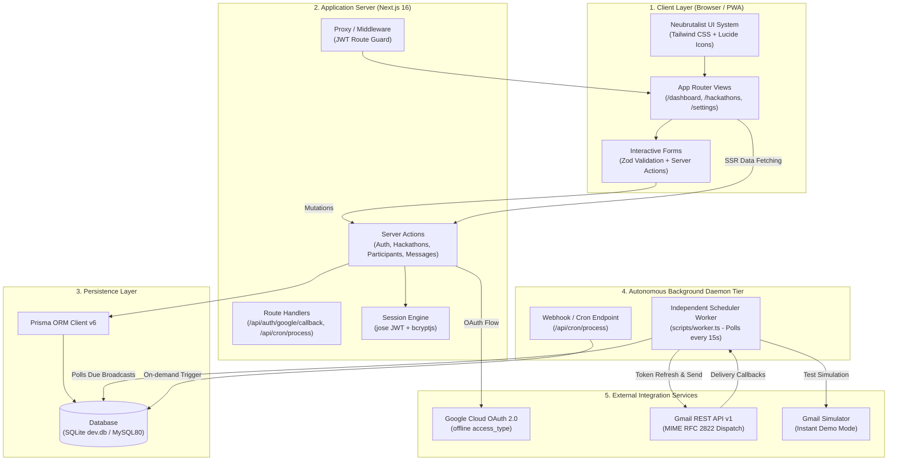
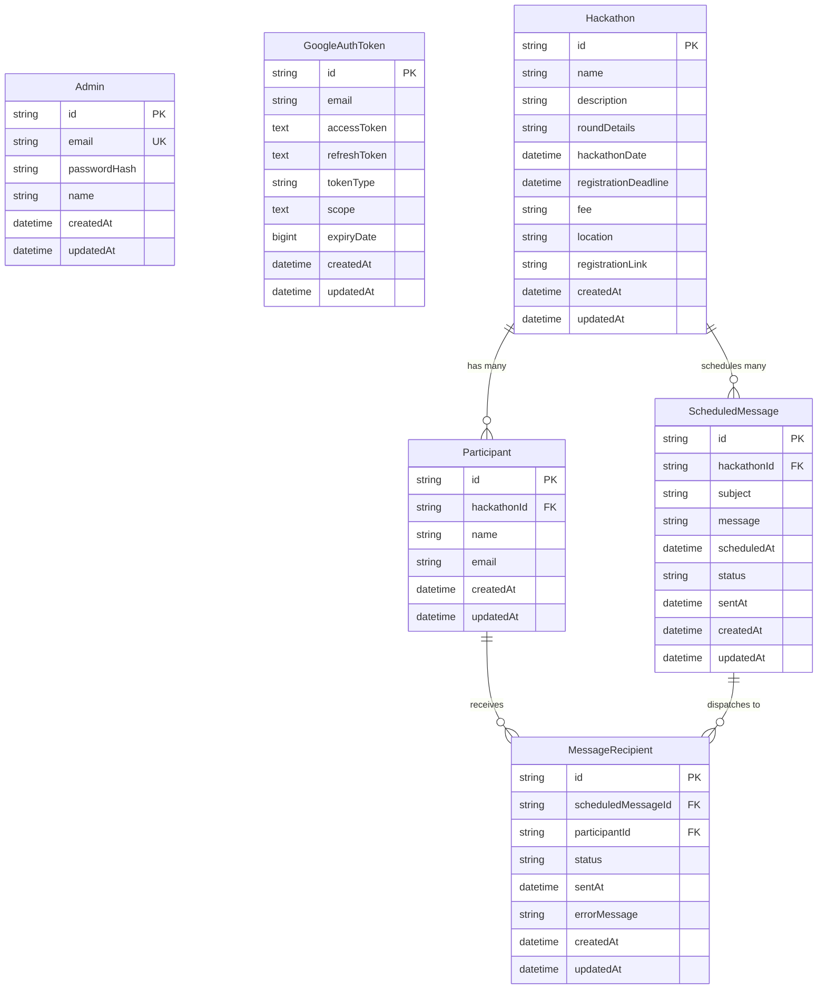
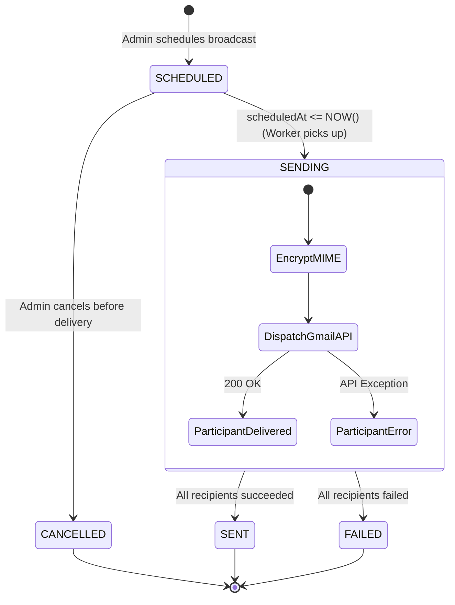
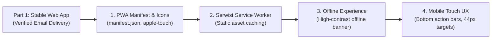

# HackTrack — System Architecture Document

A technical blueprint detailing the architectural layers, data models, dispatch engines, security posture, and design systems powering **HackTrack** — the Neubrutalist Hackathon Command Center and Automated Email Broadcast Platform.

---

## 1. High-Level System Architecture

HackTrack follows a decoupled, resilient architecture split into **Two Clean Parts**:
* **Part 1 — Web Application & Dispatch Engine**: Complete Next.js App Router application backed by Prisma ORM and an independent background Node.js scheduler daemon.
* **Part 2 — Progressive Web App (PWA)**: Installable application shell with Service Worker asset caching, offline fallback banners, and mobile touch UX.



---

## 2. Core Architectural Pillars

### A. The Browser-Independent Scheduler Daemon
A critical architectural requirement is that **scheduled broadcasts must send even if the admin closes the browser, logs out, or restarts their device**.

* **Daemon Script**: Located at `scripts/worker.ts`, run via `npm run worker`.
* **Cadence**: Autonomous 15-second polling loop using Node.js event timers.
* **Execution Lifecycle**:
  ```
  1. QUERY: Find ScheduledMessage where status == "SCHEDULED" and scheduledAt <= NOW()
  2. ATOMIC LOCK: Update status to "SENDING" in database
  3. AUTHENTICATE: Retrieve GoogleAuthToken; refresh access token if expired via OAuth2Client
  4. INTERPOLATE: Replace dynamic tags ({name}, {hackathonName}) for each participant
  5. DISPATCH: Send MIME RFC 2822 email to participant Gmail address
  6. LOG STATUS: Set MessageRecipient status to "SENT" (or "FAILED" with errorMessage)
  7. FINALIZE: Update ScheduledMessage status to "SENT"
  ```

### B. Dynamic Participant Auto-Enrollment
Broadcasts configured during hackathon creation at `/hackathons/new` automatically target all future participants:
* When a hackathon is launched with an automated broadcast, a `ScheduledMessage` is persisted.
* When new participants register via `/hackathons/[id]`, the `addParticipant` server action automatically identifies all pending `SCHEDULED` messages for that hackathon and creates pending `MessageRecipient` records.

---

## 3. Entity-Relationship Data Model



---

## 4. Key Workflows & State Machines

### Message Delivery State Machine


### Gmail OAuth & Dispatch Architecture
```
Admin Browser                  Next.js App Router             Google Cloud / MySQL
     │                                │                                │
     │── [Connect Gmail] ────────────►│                                │
     │                                │── Generate Auth URL ──────────►│ (prompt=consent,
     │◄── Redirect to Google ─────────│   (access_type=offline)        │  scope=gmail.send)
     │                                                                 │
     │── Authorize Permissions ───────────────────────────────────────►│
     │◄── Callback with ?code=xyz ─────────────────────────────────────│
     │                                │                                │
     │                                │── Exchange Code for Tokens ───►│
     │                                │◄── Access & Refresh Tokens ────│
     │                                │                                │
     │                                │── Encrypt & Store in DB ──────►│ MySQL / SQLite
     │◄── "Gmail Connected" Toast ────│                                │ (GoogleAuthToken)
```

---

## 5. Neubrutalism Design System Specification

HackTrack adheres to the **Neubrutalism** standard documented in `design.md`:

```
┌────────────────────────────────────────────────────────┐
│  NEUBRUTALISM TOKENS                                   │
├────────────────────────────────────────────────────────┤
│  Primary Surface:     #FFEB3B (Vibrant Solar Yellow)   │
│  Destructive Accent:  #FF5252 (Coral Red)              │
│  Supporting Accent:   #2196F3 (Electric Blue)          │
│  Success State:       #00E676 (Mint Green)             │
│  Neutral Dark:        #121212 (Pitch Charcoal)         │
│  Canvas Background:   #FEFDF8 (Warm Eggshell)          │
│  Borders:             3px solid #121212                │
│  Shadow:              4px 4px 0px #121212 (Hard 45°)   │
│  Active Press:        translate(2px, 2px) shadow-none  │
└────────────────────────────────────────────────────────┘
```

* **No Soft Gradients / Blur**: Cards, buttons, and badges rely on flat, high-contrast saturation.
* **Typography Hierarchy**:
  * Headings: System UI sans-serif (`font-black`, 800/900 weight, tight tracking).
  * Timestamps, Counts & Codes: `JetBrains Mono` / monospace.
* **Micro-Interactions**: Tactile button press simulation (`hover: -1px translate`, `active: 2px translate`).

---

## 6. Directory Structure & File Map

```text
hacktrack/
├── app/
│   ├── api/
│   │   ├── auth/google/callback/route.ts  # OAuth code exchange
│   │   └── cron/process/route.ts          # On-demand scheduler trigger
│   ├── dashboard/page.tsx                 # Command center KPI cards
│   ├── hackathons/
│   │   ├── page.tsx                       # Hackathon directory list
│   │   ├── new/page.tsx                   # Hackathon + Broadcast creation
│   │   └── [id]/
│   │       ├── page.tsx                   # Hackathon details, participants & messages
│   │       └── edit/page.tsx              # Edit/Delete hackathon
│   ├── login/page.tsx                     # Neubrutalist Admin authentication
│   ├── settings/page.tsx                  # Gmail OAuth & worker integration hub
│   ├── layout.tsx                         # Root shell & responsive Neubrutalist Navbar
│   └── globals.css                        # Neubrutalist design tokens & CSS utilities
├── components/
│   ├── ui/                                # Neubrutalist primitives (Button, Card, Input, Badge)
│   ├── Navbar.tsx                         # Persistent navigation header
│   ├── ParticipantManager.tsx             # Participant CRUD & registration table
│   ├── MessageScheduler.tsx               # Broadcast composer & real-time delivery logs
│   ├── GoogleConnectCard.tsx              # OAuth connection toggle & demo mode switch
│   └── EditHackathonForm.tsx              # Pre-filled edit form
├── actions/
│   ├── auth.ts                            # Admin login, logout, and session helpers
│   ├── hackathons.ts                      # Hackathon CRUD + broadcast initialization
│   ├── participants.ts                    # Participant CRUD + auto-enrollment
│   ├── messages.ts                        # Schedule message, cancel, and manual dispatch
│   └── google.ts                          # Google OAuth status and demo connector
├── lib/
│   ├── prisma.ts                          # Prisma Client singleton
│   ├── auth.ts                            # JWT session creation & verification (jose)
│   ├── gmail.ts                           # Google OAuth2 client & Gmail dispatch engine
│   ├── scheduler.ts                       # Core message processing & template engine
│   └── utils.ts                           # Neubrutalist class merge and date formatters
├── prisma/
│   ├── schema.prisma                      # Database relational schema
│   └── seed.ts                            # Admin account & sample hackathons seed
├── scripts/
│   ├── worker.ts                          # Independent 15-second background daemon
│   └── test-scheduling.ts                 # End-to-end verification script
├── middleware.ts                          # JWT route security proxy
└── .env                                   # Secrets, database URLs, and OAuth keys
```

---

## 7. Security Architecture

1. **Authentication**: Admin credentials hashed with `bcryptjs` (salt rounds: 10).
2. **Session Cookies**: Encrypted, signed JWTs via `jose`, stored in `httpOnly`, `sameSite: lax`, `secure` cookies.
3. **Route Guarding**: Next.js Proxy/Middleware intercepts unauthorized requests to `/dashboard`, `/hackathons`, and `/settings` and redirects to `/login`.
4. **OAuth Token Security**:
   * Passwords are never collected or stored.
   * Refresh tokens are stored server-side in the database.
   * Expired tokens are refreshed automatically in the background using Google's token rotation protocol.
5. **SQL Injection & XSS Protection**:
   * Prisma ORM parameterizes all queries by default.
   * Server actions validate all payloads with strict `zod` schemas.

---

## 8. Transition to Part 2 (PWA Conversion)

With Part 1 stable and verified, Part 2 converts this web application into an installable PWA:


